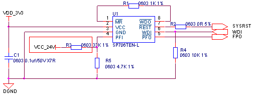
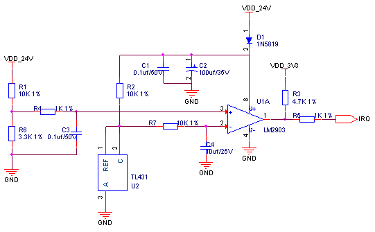

## 看门狗掉电检测

​CMC芯片内部有自带看门狗，用户根据需求可以采用内部看门狗，也可以增加外部硬件看门狗电路，如需增加外部硬件看门狗推荐电路如下图所示，此方案采用的看门狗芯片SP706T喂狗间隔为1.6s，监测电压3.08V。

看门狗电路元器件清单：

| **序号** | **位号** | **规格** | **数量** |
| --- | --- | --- | --- |
| 1 | C1 | 贴片电容 0603 0.1uf±10%/50V X7R | 1 |
| 2 | R1 | 贴片电阻 0603 1KΩ±1% | 1 |
| 3 | R2 | 贴片电阻 0603 0Ω±5% | 1 |
| 4 | R3 | 贴片电阻 0603 2KΩ±1% | 1 |
| 5 | R4 | 贴片电阻 0603 10KΩ±1% | 1 |
| 6 | U1 | 监控芯片 SP706TEN-L | 1 |

​此芯片除看门狗功能外还自带一路比较器可以用于掉电检测如下图所示。此电路在原来看门狗电路的基础上增加了红色框部分电路，R4与R5构成分压用于检测24V电压是否跌落，电压跌落低于10V时PFO输出低电平，由于芯片供电3V3与被检测24V电源共用公共地，故此方案仅适用于非隔离电路。

看门狗&掉电检测电路元器件清单：

| **序号** | **位号** | **规格** | **数量** |
| --- | --- | --- | --- |
| 1 | C1 | 贴片电容 0603 0.1uf±10%/50V X7R | 1 |
| 2 | R1 | 贴片电阻 0603 1KΩ±1% | 1 |
| 3 | R2 | 贴片电阻 0603 0Ω±5% | 1 |
| 4 | R3 | 贴片电阻 0603 33KΩ±1% | 1 |
| 5 | R4 | 贴片电阻 0603 10KΩ±1% | 1 |
| 6 | R5 | 贴片电阻 0603 4.7KΩ±1% | 1 |
| 7 | U1 | 监控芯片 SP706TEN-L | 1 |

​对于隔离电源供电的运动控制器，掉电检测电路如下图所示，电路采用比较器去检测外部电源是否已断电，R1,R6组成分压电路，当24V电压跌落到低于10V时，比较器正输入端电压低于负输入端电压（2.5V），比较器输出低，CMC检测到电平翻转判断为外部电源掉电，跌落电压阈值可根据设计需求调整。

掉电检测电路元器件清单：

| **序号** | **位号** | **规格** | **数量** |
| --- | --- | --- | --- |
| 1 | C1 C3 | 贴片电容 0603 0.1uf±10%/50V X7R | 2 |
| 2 | C2 | 电解电容 100uf±20%/35V | 1 |
| 3 | C4 | 贴片电容 0805 10uf±10%/25V X5R | 1 |
| 4 | D1 | 肖特基二极管 1N5819 | 1 |
| 5 | R1 R2 R7 | 贴片电阻 0603 10KΩ±1% | 3 |
| 6 | R3 | 贴片电阻 0603 4.7KΩ±1% | 1 |
| 7 | R4 R5 | 贴片电阻 0603 1KΩ±1% | 2 |
| 8 | R6 | 贴片电阻 0603 3.3KΩ±1% | 1 |
| 9 | U1 | 比较器芯片 LM2903 | 1 |
| 10 | U2 | 基准源芯片 TL431 | 1 |