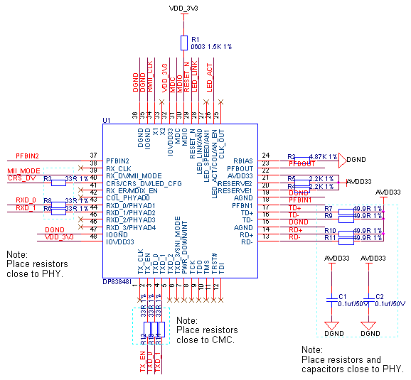

## 以太网
​CMC芯片内部集成了2路以太网MAC，采用RMII接口，通讯速率10M/100M。推荐电路如下图所示,此方案电路中RJ45内部已集成了网络变压器，隔离电压1500V。

以太网通讯电路元器件清单：

| **序号** | **位号** | **规格** | **数量** |
| --- | --- | --- | --- |
| 1 | C1-C9 C11 C12 | 贴片电容 0603 0.1uf±10%/50V X7R | 11 |
| 2 | C13 | 贴片电容 0603 10pf±5%/50V NP0 | 1 |
| 3 | C10 | 贴片电容 0805 10uf±10%/25V X5R | 1 |
| 4 | L1 | 磁珠 60Ω@100MHz/3A | 1 |
| 5 | R1 | 贴片电阻 0603 1.5KΩ±1% | 1 |
| 6 | R2 | 贴片电阻 0603 4.87KΩ±1% | 1 |
| 7 | R7 R9 R10 R11 | 贴片电阻 0603 49.9Ω±1% | 4 |
| 8 | R3 R6 R8 R12 R13 R14 | 贴片电阻 0603 33Ω±1% | 6 |
| 9 | R4 R5 R18 | 贴片电阻 0603 2.2KΩ±1% | 3 |
| 10 | R15 R16 | 贴片电阻 0603 1KΩ±1% | 2 |
| 11 | R17 | 贴片电阻 0603 100Ω±1% | 1 |
| 12 | U1 | PHY芯片 DP83848 | 1 |
| 13 | U2 | ESD二极管 NUP4114 | 1 |
| 14 | X1 | 有源晶振 50MHz±20ppm | 1 |
| 15 | CN1 | RJ45 HR911105A | 1 |

​在网线的选择方面，建议采用5类或更高等级的网线。