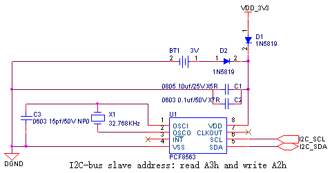

## 实时时钟
如需实时时钟功能时，需外挂实时时钟芯片，推荐型号PCF8563，芯片需要接32.768KHz晶振，为了确保时钟芯片断电后能正常工作还需要提供外部电池供电，通讯接口SCL、SDA需接10K或4.7K电阻上拉，推荐电路见下图所示。

实时时钟电路元器件清单:

| **序号** | **位号** | **规格** | **数量** |
| --- | --- | --- | --- |
| 1 | C1 | 贴片电容 0805 10uf±10%/25V X5R | 1 |
| 2 | C2 | 贴片电容 0603 0.1uf±10%/50V X7R | 1 |
| 3 | C3 | 贴片电容 0603 15pf±5%/50V NP0 | 1 |
| 4 | D1 D2 | 肖特基二极管 1N5819 | 2 |
| 5 | U1 | 时钟芯片 PCF8563 | 1 |
| 6 | X1 | 无源晶振 32.768kHz±20ppm | 1 |
| 7 | BT1 | 3V电池座/接口 | 1 |