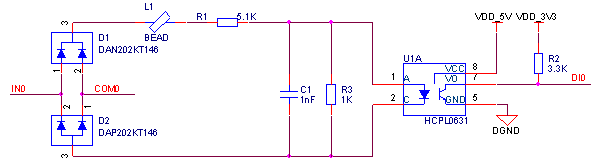

## 开关量输入
(1) 普通输入 
采用光耦隔离输入，选用光耦可以根据通道数不同选择单通道、双通道或四通道光耦；根据输入接口类型不同可以选用单向导通或双向导通光耦。推荐电路如下图所示，用户根据设计需求更换不同的光耦可以组成不同的输入类型。

普通光耦输入电路元器件清单：

| **序号** | **位号** | **规格** | **数量** |
| --- | --- | --- | --- |
| 1 | C1 | 贴片电容 0603 1nf±10%/50V X7R | 1 |
| 2 | L1 | 磁珠 120Ω@100MHz 0.1A | 1 |
| 3 | R1 | 贴片电阻 0603 3.3KΩ±1% | 1 |
| 4 | R2 | 贴片电阻 0603 1KΩ±1% | 1 |
| 5 | R3 | 贴片电阻 1206 5.1KΩ±1% | 1 |
| 6 | U1 | 光耦 EL354 | 1 |

(2) 高速输入
采用高速光耦隔离输入，选用光耦可以根据通道数不同选择单通道或双通道光耦。根据输入接口类型不同可以设计带COM口输入或单端输入，推荐电路如下图所示，此电路为带COM口输入设计。

高速光耦输入电路元器件清单：

| **序号** | **位号** | **规格** | **数量** |
| --- | --- | --- | --- |
| 1 | C1 | 贴片电容 0603 1nf±10%/50V X7R | 1 |
| 2 | D1 | 开关二极管 DAN202KT146 | 1 |
| 3 | D2 | 开关二极管 DAP202KT146 | 1 |
| 4 | L1 | 磁珠 120Ω@100MHz 0.1A | 1 |
| 5 | R1 | 贴片电阻 1206 5.1KΩ±1% | 1 |
| 6 | R2 | 贴片电阻 0603 3.3KΩ±1% | 1 |
| 7 | R3 | 贴片电阻 0603 1KΩ±1% | 1 |
| 8 | U1 | 高速光耦 HCPL-0631-500E | 1 |
