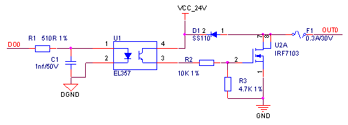
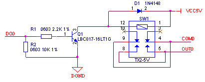

## 开关量输出
(1) 晶体管输出

- 源型输出,电平信号采用光耦隔离，输出端用三极管驱动，有效输出时电平为高电平，推荐电路如下图所示，此电路COM0口需外接电源，输出电压略低于电源电压。

晶体管源型输出电路元器件清单：

| **序号** | **位号** | **规格** | **数量** |
| --- | --- | --- | --- |
| 1 | C1 | 贴片电容 0603 1nf±10%/50V X7R | 1 |
| 2 | F1 | PTC 0.3A/30V | 1 |
| 3 | Q1 | 三极管 PNP 2SA1417 | 1 |
| 4 | R1 | 贴片电阻 0603 4.7KΩ±1% | 1 |
| 5 | R2 | 贴片电阻 0603 1KΩ±1% | 1 |
| 6 | R3 | 贴片电阻 0603 3KΩ±1% | 1 |
| 7 | U1 | 光耦 EL357 | 1 |

- 漏型输出，电平信号采用光耦隔离，输出端用NMOS驱动，有效输出时电平为低电平，推荐电路如下图所示。

晶体管漏型输出电路元器件清单：

| **序号** | **位号** | **规格** | **数量** |
| --- | --- | --- | --- |
| 1 | C1 | 贴片电容 0603 1nf±10%/50V X7R | 1 |
| 2 | D1 | 肖特基二极管 SS110 | 1 |
| 3 | F1 | PTC 0.3A/30V | 1 |
| 4 | R1 | 贴片电阻 0603 510Ω±1% | 1 |
| 5 | R2 | 贴片电阻 0603 10KΩ±1% | 1 |
| 6 | R3 | 贴片电阻 0603 4.7KΩ±1% | 1 |
| 7 | U1 | 光耦 EL357 | 1 |
| 8 | U2A | MOS管 NMOS IRF7103 | 1 |

(2) 继电器输出

继电器型输出推荐电路如下图所示。

继电器输出电路元器件清单：

| **序号** | **位号** | **规格** | **数量** |
| --- | --- | --- | --- |
| 1 | D1 | 通用二极管 1N4148 | 1 |
| 2 | Q1 | 三极管 NPN LBC817-16LT1G | 1 |
| 3 | R1 | 贴片电阻 0603 2.2KΩ±1% | 1 |
| 4 | R2 | 贴片电阻 0603 10KΩ±1% | 1 |
| 5 | SW1 | 继电器 DC5V | 1 |