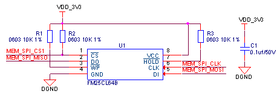

## FRAM
FRAM通过SPI进行扩展，推荐电路见下图，电路中FRAM容量是8KByte，也可以根据自身需求更换其他容量的FRAM芯片。

FRAM电路元器件清单:

| **序号** | **位号** | **规格** | **数量** |
| --- | --- | --- | --- |
| 1 | C1 | 贴片电容 0603 0.1uf±10%/50V X7R | 1 |
| 2 | R1 R2 R3 | 贴片电阻 0603 10KΩ±1% | 3 |
| 3 | U1 | 存储芯片 FM25CL64B | 1 |