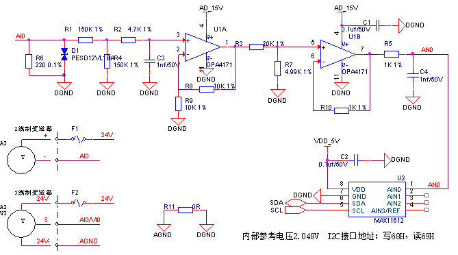
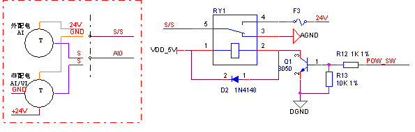

# 模拟量输入
模拟量输入需要采用模数转换芯片去实现，模拟量输入可以分为电压与电流输入。其统一都能用如下图所示电路进行设计，其中电流输入电路，需要在输入端并联一个精密电阻（图中R6）将电流转成电压信号，而电压输入电路，则不需要并联精密电阻。

此推荐电路采用的模数转换芯片为MAX11612，精度12位，支持4路模拟量输入，内部基准电压4.096V。此电路模数转换芯片采用I2C通讯，需注意有多路I2C设备时地址是否有冲突。

图中电路增加了变送器的接线示意图，这里主要介绍下2线制与3线制的接线方法及不同的配电模式。

电流型模拟量输入设备可以接2线制或3线制的电流型变送器，接2线制的变送器时变送器的输入（+）接设备输出电源24V+，变送器的输出（-）接设备的模拟量输入端口（AI0）。接3线制的变送器时，变送器的电源（24V）接设备输出电源24V+，变送器的输出（S）接设备的模拟量输入端口(AI0)，变送器的地（24V-）接设备的地(DGND)，3线制的变送器电源也可以通过开关电源供电，不过需要设备地与变送器共地。

电压型模拟量输入设备可以接3线制的电压型变送器，变送器的电源（24V）接设备输出电源24V+，变送器的输出（S）接设备的模拟量输入端口(VI0)，变送器的地（24V-）接设备的地(DGND)，变送器电源也可以通过开关电源供电，不过需要设备地与变送器共地。

根据配电模式不同，可以分为外配电与非配电模式，如上图所示，接线端口S/S端默认为接AGND，为非配电模式，非配电模式下变送器需要外接24V电源。当变送器需要外配电时，通过控制继电器切换电源，S/S端输出为24V电源接外配电变送器。

模拟量输入电路元器件清单：

| **序号** | **位号** | **规格** | **数量** |
| --- | --- | --- | --- |
| 1 | C1 C2 | 贴片电容 0603 0.1uf±10%/50V X7R | 2 |
| 2 | C3 C4 | 贴片电容 0603 1nf±10%/50V X7R | 2 |
| 3 | D1 | ESD二极管 PESD12VL1BA | 1 |
| 4 | R1 R4 | 贴片电阻 0805 150KΩ±1% | 2 |
| 5 | R2 | 贴片电阻 0603 4.7KΩ±1% | 1 |
| 6 | R3 | 贴片电阻 0603 20KΩ±1% | 1 |
| 7 | R5 R10 | 贴片电阻 0603 1KΩ±1% | 2 |
| 8 | R6 | 贴片电阻 0603 220Ω±0.1% | 1 |
| 9 | R7 | 贴片电阻 0603 4.99KΩ±1% | 1 |
| 10 | R8 R9 | 贴片电阻 0603 10KΩ±1% | 2 |
| 11 | U1 | 通用运放 OPA4171 | 1 |
| 12 | U2 | 模数转换芯片 MAX11612 | 1 |

该电路为模拟量输入通用电路，只需要修改R3和R7的比例，即可满足0-10V，0-5V，0-2.5V，0-20mA等多种电压电流输入模式，详见下表。

| **输入范围** | **R3/Ω** | **R7/Ω** | **R6/Ω** |
| --- | --- | --- | --- |
| 0-10V | 20K | 4.99K | 不贴 |
| 0-5V | 20K | 13.3K | 不贴 |
| 0-2.5V | 5k | 20k | 不贴 |
| 0-20mA | 12K | 10K | 220 |