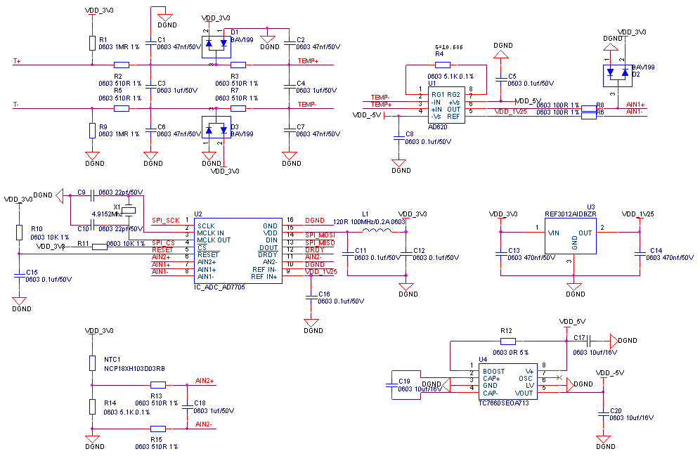

## 热电偶

热电偶采集需要采用模数转换芯片去实现，通过将微弱的温差电势安全、无噪地放大；同时，通过独立的温度传感器精确获取冷端温度，并在数字域利用热电偶分度表进行电压叠加（补偿）和非线性校正，最终还原出热端被测物体的绝对温度值。

此推荐电路采用的模数转换芯片为AD7705BRUZ-REEL，精度16位，支持2组模拟量差分输入，模数转换芯片通过SPI通讯。

上图中T+,T-为热电偶的接入点，RESET信号为AD7705的复位端口，RESET信号被拉低芯片复位。DRDY信号为数据准备完成信号，低电平代表数据准备完成，高电平表示数据已读取。

热电偶电路元器件清单：

| **序号** | **位号** | **规格** | **数量** |
| --- | --- | --- | --- |
| 1 | C9 C10 | 贴片电容 0603 22pf±5%/50V NP0 | 2 |
| 2 | C1 C2 C6 C7 | 贴片电容 0603 47nf±5%/50V X7R | 4 |
| 3 | C5 C8 C11 C12 C15 C16 | 贴片电容 0603 0.1uf±10%/50V X7R | 6 |
| 4 | C13 C14 | 贴片电容 0603 470nf±10%/50V X5R | 2 |
| 5 | C3 C4 C18 | 贴片电容 0603 1uf±10%/50V X5R | 3 |
| 6 | C17 C19 C20 | 贴片电容 0603 10uf±10%/16V X5R | 3 |
| 7 | R12 | 贴片电阻 0603 0Ω±5% | 1 |
| 8 | R6 R8 | 贴片电阻 0603 100Ω±1% | 2 |
| 9 | R2 R3 R5 R7 R13 R15 | 贴片电阻 0603 510Ω±1% | 6 |
| 10 | R4 R14 | 贴片电阻 0603 5.1KΩ±0.1% | 2 |
| 11 | R10 R11 | 贴片电阻 0603 10KΩ±1% | 2 |
| 12 | R1 R9 | 贴片电阻 0603 1MΩ±1% | 2 |
| 13 | NTC1 | NCP18XH103D03RB | 1 |
| 14 | D1 D2 D3 | BAV199 | 3 |
| 15 | L1 | BLM18BA121SN1D | 1 |
| 16 | U1 | AD620ARZ-REEL | 1 |
| 17 | U2 | AD7705BRUZ-REEL | 1 |
| 18 | U3 | REF3012AIDBZR | 1 |
| 19 | U4 | TC7660SEOA713 | 1 |
| 20 | X1 | H6OEL89CSC-SUGYLC-4.915 | 1 |