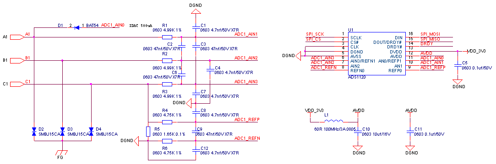

## 热电阻

PT100温度采集通常通过高精度模数转换芯片实现：首先为PT100提供稳定、低噪声的恒流源，将其随温度变化的电阻值转换为微弱电压信号，并进行安全、低噪声放大。

此示例电路采用的模数转换芯片为ADS1120IPWR，精度16位，模数转换芯片通过SPI通讯。

上图中A1,B1,C1为PT100的接入点，DRDY信号为数据准备完成信号，低电平代表数据准备完成。

PT100电路元器件清单：

| **序号** | **位号** | **规格** | **数量** |
| --- | --- | --- | --- |
| 1 | C1 C4 C7 C8 C12 | 贴片电容 0603 4.7nf±10%/50V X7R | 5 |
| 2 | C2 C3 C6 C9 | 贴片电容 0603 47nf±5%/50V X7R | 4 |
| 3 | C5 C11 | 贴片电容 0603 0.1uf±10%/50V X7R | 2 |
| 4 | C10 | 贴片电容 0603 10uf±10%/16V X5R | 1 |
| 5 | R4 R6 | 贴片电阻 0603 4.75KΩ±1% | 2 |
| 6 | R1 R2 R3 | 贴片电阻 0603 4.99KΩ±1% | 3 |
| 7 | R5 | 贴片电阻 0603 1.65KΩ±0.1% | 1 |
| 8 | D1 | 肖特基二极管 BAT54 0.2A/30V SOD123 | 1 |
| 9 | D2 D3 D4 | TVS二极管 SMBJ15CA 16.7V DO214AA | 3 |
| 10 | L1 | 磁珠 PZ2012U600-3R0TF 60Ω@100MHz/3A 0805 | 1 |
| 11 | U1 | ADS1120IPWR | 1 |