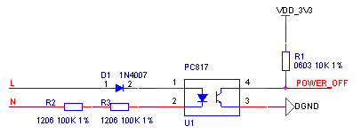

## 看门狗掉电检测
CMC芯片内部有自带看门狗，用户根据自身需求配置外部看门狗电路，推荐电路如下图所示，此方案采用的看门狗芯片SP706T喂狗间隔为1.6s，监测电压3.08V。

看门狗电路元器件清单:

| **序号** | **位号** | **规格** | **数量** |
| --- | --- | --- | --- |
| 1 | C1 | 贴片电容 0603 0.1uf±10%/50V X7R | 1 |
| 2 | R1 | 贴片电阻 0603 1KΩ±1% | 1 |
| 3 | R2 | 贴片电阻 0603 0Ω±5% | 1 |
| 4 | R3 | 贴片电阻 0603 2KΩ±1% | 1 |
| 5 | R4 | 贴片电阻 0603 10KΩ±1% | 1 |
| 6 | U1 | 监控芯片 SP706TEN-L | 1 |

此芯片除看门狗功能外还自带一路比较器可以用于掉电检测见下图所示。此电路在原来看门狗电路的基础上增加了红色框部分电路，R4与R5构成分压用于检测24V电压是否跌落，电压跌落低于10V时PFO输出低电平，由于芯片供电3V3与被检测24V电源共用公共地，故此方案仅适用于非隔离电路。

看门狗&掉电检测电路元器件清单:

| **序号** | **位号** | **规格** | **数量** |
| --- | --- | --- | --- |
| 1 | C1 | 贴片电容 0603 0.1uf±10%/50V X7R | 1 |
| 2 | R1 | 贴片电阻 0603 1KΩ±1% | 1 |
| 3 | R2 | 贴片电阻 0603 0Ω±5% | 1 |
| 4 | R3 | 贴片电阻 0603 33KΩ±1% | 1 |
| 5 | R4 | 贴片电阻 0603 10KΩ±1% | 1 |
| 6 | R5 | 贴片电阻 0603 4.7KΩ±1% | 1 |
| 7 | U1 | 监控芯片 SP706TEN-L | 1 |

对于交流供电的PLC，掉电监测电路如下图所示，电路采用1颗普通二极管，3个电阻，1个光耦构成了掉电检测电路，信号频率为50Hz。

掉电检测电路元器件清单:

| **序号** | **位号** | **规格** | **数量** |
| --- | --- | --- | --- |
| 1 | R2 R3 | 贴片电阻 1206 100K | 2 |
| 2 | R1 | 贴片电阻 0603 10K | 1 |
| 3 | U1 | 光耦 PC817 | 1 |
| 4 | D1 | 通用二极管 1N4007 | 1 |