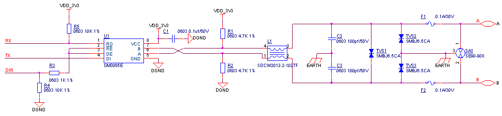

## RS485
RS485通讯方案，推荐电路如下图所示。

RS485电路元器件清单:

| **序号** | **位号** | **规格** | **数量** |
| --- | --- | --- | --- |
| 1 | C1 | 贴片电容 0603 0.1uf±10%/50V X7R | 1 |
| 2 | C2 C3 | 贴片电容 0603 100pf±10%/50V N0P | 2 |
| 3 | TVS1 TVS2 TVS3 | TVS二极管 SMBJ6.5CA | 3 |
| 4 | F1 F2 | PTC 0.1A/30V | 2 |
| 5 | R1 R2 | 贴片电阻 0603 4.7KΩ±1% | 2 |
| 6 | R3 | 贴片电阻 0603 1KΩ±1% | 1 |
| 7 | R4 R5 | 贴片电阻 0603 10KΩ±1% | 2 |
| 8 | SA1 | 放电管 SE90-90X | 1 |
| 9 | L1 | 共模滤波器 SDCW2012-2-102TF | 1 |
| 10 | U1 | RS485芯片 GM3085E | 1 |