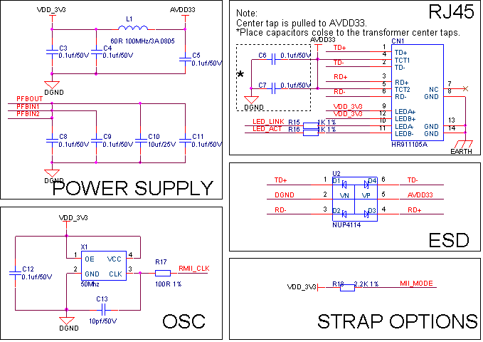
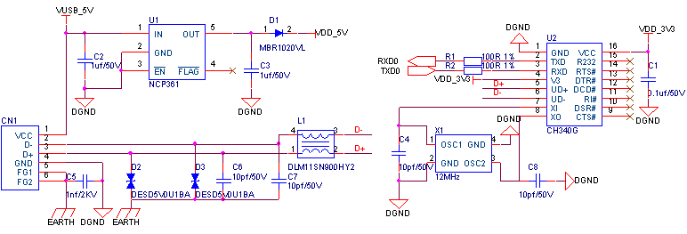
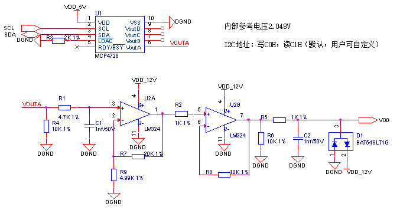
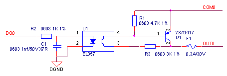
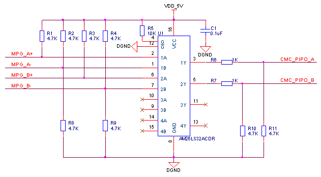
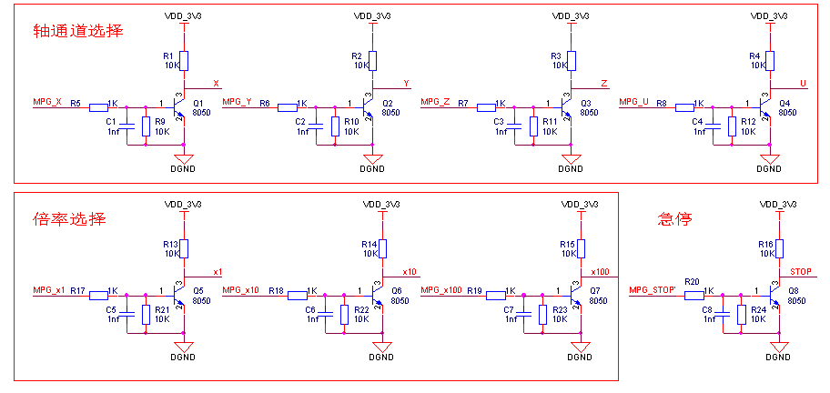

# 基于CMC控制芯片的运动控制器硬件设计方案

## 概述

本文档主要对基于CMC控制芯片进行运动控制器硬件设计的方案进行了介绍，包括常用运动控制器的硬件组成部分，并详细列举了运动控制器电路的组成和方案，对元器件进行了选型。最后以设计一款通用运动控制器为例进行了元器件清单说明。

​基于此文档，用户可基于自身产品的需求，快速评估出设计一款运动控制器所需要的硬件物料清单和成本，也为研发工程师进行运动控制器电路设计提供了参考。

## 系统组成

​运动控制器系统一般由硬件PCB板、外壳结构、接插件端子组成：

- 硬件PCB主要由主控CPU、电源、存储器、通讯接口、输入电路和输出电路组成。本设计方案的第三部分，为用户提供了基于CMC控制芯片进行运动控制器设计的常用电路，用户可根据实际需求进行参考，设计出符合自身需求的运动控制器。
- 外壳结构是指运动控制器的外部结构，用户可以根据自身需求，进行外壳的选型和设计，在确认完外壳结构后，再进行对应的PCB设计，就能实现一个完整运动控制器的硬件系统。
- 接插件端子是指用于运动控制器接线的端子，用户可根据外壳结构及系统需求进行选型与设计。

## 电路设计方案

### 电源

​运动控制器的电源部分，主要包括系统供电部分和芯片内核电源部分，其中系统供电的输入一般有隔离的24V直流输入与非隔离的24V直流输入，芯片内核电源主要有3.3V和1.2V两个电源，这里对这几个电源的设计逐一进行说明。

#### 非隔离直流输入

​非隔离方案中直流24V转5V采用DC/DC降压电路，推荐电路见下图所示，推荐电路设计输出为5V/2A。电源芯片型号为TPS54340，最大支持42V输入3.5A输出，支持100KHz到2.5MHz的固定或可调节开关频率。

直流降压型24V转5V电路

{:align="center"}

直流降压型24V转5V电路元器件清单

| **序号** | **位号** | **规格** | **数量** |
| --- | --- | --- | --- |
| 1 | C1 C7 | 贴片电容 0603 1nf±10%/50V X7R | 2 |
| 2 | C2 C4 | 贴片电容 0603 0.1uf±10%/50V X7R | 2 |
| 3 | C3 | 电解电容 47uf±20%/16V | 1 |
| 4 | C5 | 贴片电容 0805 4.7uf±10%/50V X5R | 1 |
| 5 | C6 | 贴片电容 0603 15pf±5%/50V NP0 | 1 |
| 6 | D1 | 肖特基二极管 SS56 | 1 |
| 7 | L1 | 电感 10uH±20%/2.7A | 1 |
| 8 | R1 | 贴片电阻 0603 100Ω±1% | 1 |
| 9 | R2 | 贴片电阻 0603 60.4KΩ±1% | 1 |
| 10 | R3 | 贴片电阻 0603 300KΩ±1% | 1 |
| 11 | R4 | 贴片电阻 0603 20KΩ±1% | 1 |
| 12 | R5 | 贴片电阻 0603 130KΩ±1% | 1 |
| 13 | R6 | 贴片电阻 0603 23.7KΩ±1% | 1 |
| 14 | R7 | 贴片电阻 0603 11.5KΩ±1% | 1 |
| 15 | U1 | 电源芯片 TPS54340 | 1 |

#### 隔离直流输入

​隔离方案中直流24V转5V推荐电路见下图所示，电源采用金升阳DC/DC隔离电源模块VRB2405YMD,此方案中隔离电压等级2500V，最大输入电压36V，输出电流1.2A。

24V转5V隔离电路

24V转5V隔离电路元器件清单

| **序号** | **位号** | **规格** | **数量** |
| --- | --- | --- | --- |
| 1 | C1 C2 C3 C5 C7 | 贴片电容 0603 0.1uf±10%/50V X7R | 5 |
| 2 | C8 | 贴片电容 0805 10uf±10%/50V X5R | 1 |
| 3 | C9 | 贴片电容 1210 100uf±20%/6.3V X5R | 1 |
| 4 | C4 | 电解电容 47uf±20%/50V | 1 |
| 5 | C6 | 电解电容 100uf±20%/50V | 1 |
| 6 | D1 | 肖特基二极管 SS14 | 1 |
| 7 | D2 | TVS二极管 SMAJ6.5CA | 1 |
| 8 | L2 | 共模电感 500uH 0.7A | 1 |
| 9 | L1 | 功率电感 0.7A | 1 |
| 10 | U1 | 隔离电源 VRB2405YMD-6WR3 | 1 |

#### 内核电源

​内核电源主要是指CMC芯片工作所需的3.3V供电和1.2V供电。

​5V转3.3V降压推荐电路如下图所示，电源芯片选用封装为TO252的LDO。

5V转3.3V降压电路

5V转3.3V降压电路元器件清单

| **序号** | **位号** | **规格** | **数量** |
| --- | --- | --- | --- |
| 1 | C1 C3 | 贴片电容 0805 10uf±10%/25V X5R | 2 |
| 2 | C2 C4 | 贴片电容 0603 0.1uf±10%/50V X7R | 2 |
| 3 | U1 | 电源芯片 LD1086DT33TR | 1 |

​5V转1.2V降压推荐电路如下图所示，电源芯片选用封装为TO252的LDO。

5V转1.2V降压电路

5V转1.2V降压电路元器件清单

| **序号** | **位号** | **规格** | **数量** |
| --- | --- | --- | --- |
| 1 | C1 C3 | 贴片电容 0805 10uf±10%/25V X5R | 2 |
| 2 | C2 C4 | 贴片电容 0603 0.1uf±10%/50V X7R | 2 |
| 3 | U1 | 电源芯片 LD1117DT12CTR | 1 |

### 主控CPU

​主控CPU部分电路包含了JTAG电路、复位电路及时钟电路，此部分电路为官方推荐参考电路，非必要不建议修改，参考电路见下图所示。

主控CPU电路

<figure align="center">
  
</figure>

主控CPU元器件清单

| **序号** | **位号** | **规格** | **数量** |
| --- | --- | --- | --- |
| 1 | C1-C30 | 贴片电容 0603 0.1uf±10%/50V X7R | 30 |
| 2 | C32 | 贴片电容 0603 15pf±5%/50V NP0 | 1 |
| 3 | C31 | 贴片电容 0603 1uf±10%/50V X5R | 1 |
| 4 | R1 R7 | 贴片电阻 0603 100Ω±1% | 2 |
| 5 | R2 R3 R4 R5 R6 | 贴片电阻 0603 10KΩ±1% | 5 |
| 6 | X1 | 有源晶振 10MHz±20ppm | 1 |
| 7 | U1 | CMC芯片 CMC693PR144 | 1 |
| 8 | CN1 | 连接器 5Pin-2.0mm双排针 | 1 |

### 实时时钟

​如需实时时钟功能时，需外挂实时时钟芯片，推荐型号PCF8563，芯片需要接32.768kHz晶振，为了确保时钟芯片断电后能正常工作还需要提供外部电池供电，通讯接口SCL、SDA需接10K或4.7K电阻上拉，推荐电路见下图所示。

实时时钟电路

实时时钟电路元器件清单

| **序号** | **位号** | **规格** | **数量** |
| --- | --- | --- | --- |
| 1 | C1 | 贴片电容 0805 10uf±10%/25V X5R | 1 |
| 2 | C2 | 贴片电容 0603 0.1uf±10%/50V X7R | 1 |
| 3 | C3 | 贴片电容 0603 15pf±5%/50V NP0 | 1 |
| 4 | D1 D2 | 肖特基二极管 1N5819 | 2 |
| 5 | U1 | 时钟芯片 PCF8563 | 1 |
| 6 | X1 | 无源晶振 32.768kHz±20ppm | 1 |
| 7 | BT1 | 3V电池座/接口 | 1 |

### 看门狗与掉电检测

​CMC芯片内部有自带看门狗，用户根据需求可以采用内部看门狗，也可以增加外部硬件看门狗电路，如需增加外部硬件看门狗推荐电路如下图所示，此方案采用的看门狗芯片SP706T喂狗间隔为1.6s，监测电压3.08V。

看门狗电路

看门狗电路元器件清单

| **序号** | **位号** | **规格** | **数量** |
| --- | --- | --- | --- |
| 1 | C1 | 贴片电容 0603 0.1uf±10%/50V X7R | 1 |
| 2 | R1 | 贴片电阻 0603 1KΩ±1% | 1 |
| 3 | R2 | 贴片电阻 0603 0Ω±5% | 1 |
| 4 | R3 | 贴片电阻 0603 2KΩ±1% | 1 |
| 5 | R4 | 贴片电阻 0603 10KΩ±1% | 1 |
| 6 | U1 | 监控芯片 SP706TEN-L | 1 |

​此芯片除看门狗功能外还自带一路比较器可以用于掉电检测见下图所示。此电路在原来看门狗电路的基础上增加了红色框部分电路，R4与R5构成分压用于检测24V电压是否跌落，电压跌落低于10V时PFO输出低电平，由于芯片供电3V3与被检测24V电源共用公共地，故此方案仅适用于非隔离电路。

看门狗&掉电检测电路

看门狗&掉电检测电路元器件清单

| **序号** | **位号** | **规格** | **数量** |
| --- | --- | --- | --- |
| 1 | C1 | 贴片电容 0603 0.1uf±10%/50V X7R | 1 |
| 2 | R1 | 贴片电阻 0603 1KΩ±1% | 1 |
| 3 | R2 | 贴片电阻 0603 0Ω±5% | 1 |
| 4 | R3 | 贴片电阻 0603 33KΩ±1% | 1 |
| 5 | R4 | 贴片电阻 0603 10KΩ±1% | 1 |
| 6 | R5 | 贴片电阻 0603 4.7KΩ±1% | 1 |
| 7 | U1 | 监控芯片 SP706TEN-L | 1 |

​对于隔离电源供电的运动控制器，掉电检测电路见下图所示，电路采用比较器去检测外部电源是否已断电，R1,R6组成分压电路，当24V电压跌落到低于10V时，比较器正输入端电压低于负输入端电压（2.5V），比较器输出低，CMC检测到电平翻转判断为外部电源掉电，跌落电压阈值可根据设计需求调整。

掉电检测电路

掉电检测电路元器件清单

| **序号** | **位号** | **规格** | **数量** |
| --- | --- | --- | --- |
| 1 | C1 C3 | 贴片电容 0603 0.1uf±10%/50V X7R | 2 |
| 2 | C2 | 电解电容 100uf±20%/35V | 1 |
| 3 | C4 | 贴片电容 0805 10uf±10%/25V X5R | 1 |
| 4 | D1 | 肖特基二极管 1N5819 | 1 |
| 5 | R1 R2 R7 | 贴片电阻 0603 10KΩ±1% | 3 |
| 6 | R3 | 贴片电阻 0603 4.7KΩ±1% | 1 |
| 7 | R4 R5 | 贴片电阻 0603 1KΩ±1% | 2 |
| 8 | R6 | 贴片电阻 0603 3.3KΩ±1% | 1 |
| 9 | U1 | 比较器芯片 LM2903 | 1 |
| 10 | U2 | 基准源芯片 TL431 | 1 |

### 扩展存储

#### FLASH

​FLASH通过SPI进行扩展，推荐电路见下图，电路中FLASH容量是32MByte，也可以根据自身需求更换其他容量的FLASH芯片。

FLASH电路图

FLASH电路元器件清单

| **序号** | **位号** | **规格** | **数量** |
| --- | --- | --- | --- |
| 1 | C1 | 贴片电容 0603 0.1uf±10%/50V X7R | 1 |
| 2 | R1 R2 R3 | 贴片电阻 0603 10KΩ±1% | 3 |
| 3 | U1 | 存储芯片 W25Q256JVEIQ | 1 |

#### FRAM

​FRAM通过SPI进行扩展，推荐电路见下图，电路中FRAM容量是8KByte，也可以根据自身需求更换其他容量的FRAM芯片。

FRAM电路图

FRAM电路元器件清单

| **序号** | **位号** | **规格** | **数量** |
| --- | --- | --- | --- |
| 1 | C1 | 贴片电容 0603 0.1uf±10%/50V X7R | 1 |
| 2 | R1 R2 R3 | 贴片电阻 0603 10KΩ±1% | 3 |
| 3 | U1 | 存储芯片 FM25CL64B | 1 |

#### EEPROM

​EEPROM通过I2C进行扩展，推荐电路见下图，电路中EEPROM容量是64KByte，也可以根据自身需求更换其他容量的EEPROM芯片。电路中多个设备用到I2C总线时需确认各设备地址是否有冲突。

EEPROM电路

EEPROM电路元器件清单

| **序号** | **位号** | **规格** | **数量** |
| --- | --- | --- | --- |
| 1 | C1 | 贴片电容 0603 0.1uf±10%/50V X7R | 1 |
| 2 | R1 | 贴片电阻 0603 4.7KΩ±1% | 1 |
| 3 | R2 R3 | 贴片电阻 0603 10KΩ±1% | 2 |
| 4 | U1 | 存储芯片 AT24C512C | 1 |

#### TF卡

​TF卡接口通过SPI进行扩展，推荐电路见下图，电路中卡座连接器为标准接口适配TF卡，TF卡容量根据需求自主选择。

TF卡接口电路图

TF卡接口电路元器件清单

| **序号** | **位号** | **规格** | **数量** |
| --- | --- | --- | --- |
| 1 | C1 C2 | 贴片电容 0603 0.1uf±10%/50V X7R | 1 |
| 2 | R1 R2 | 贴片电阻 0603 10KΩ±1% | 2 |
| 3 | U1 | TF卡座连接器 | 1 |

### 通讯

#### RS232

​RS232通讯方案，推荐电路见下图所示。

 RS232电路图

RS232电路元器件清单

| **序号** | **位号** | **规格** | **数量** |
| --- | --- | --- | --- |
| 1 | C1-C5 | 贴片电容 0603 0.1uf±10%/50V X7R | 5 |
| 2 | R1 R2 | 贴片电阻 0603 100Ω±1% | 2 |
| 3 | U1 | RS232芯片 MAX3232 | 1 |
| 4 | TVS1 TVS2 | TVS二极管 SMBJ15CA | 2 |
| 5 | C6 C7 | 贴片电容 0603 330pf±10%/50V N0P | 2 |
| 6 | L1 L2 | 磁珠 0603 600Ω@100MHz/0.5A | 2 |

#### RS485

​RS485通讯方案，推荐电路见下图所示。

RS485电路图

RS485电路元器件清单

| **序号** | **位号** | **规格** | **数量** |
| --- | --- | --- | --- |
| 1 | C1 | 贴片电容 0603 0.1uf±10%/50V X7R | 1 |
| 2 | C2 C3 | 贴片电容 0603 100pf±10%/50V N0P | 2 |
| 3 | TVS1 TVS2 TVS3 | TVS二极管 SMBJ6.5CA | 3 |
| 4 | F1 F2 | PTC 0.1A/30V | 2 |
| 5 | R1 R2 | 贴片电阻 0603 4.7KΩ±1% | 2 |
| 6 | R3 | 贴片电阻 0603 1KΩ±1% | 1 |
| 7 | R4 R5 | 贴片电阻 0603 10KΩ±1% | 2 |
| 8 | SA1 | 放电管 SE90-90X | 1 |
| 9 | L1 | 共模滤波器 SDCW2012-2-102TF | 1 |
| 10 | U1 | RS485芯片 GM3085E | 1 |

#### 以太网

​CMC芯片内部集成了2路以太网MAC，采用RMII接口，通讯速率10M/100M。推荐电路如下图所示,此方案电路中RJ45内部已集成了网络变压器，隔离电压1500V。

以太网通讯电路图

以太网通讯电路元器件清单

| **序号** | **位号** | **规格** | **数量** |
| --- | --- | --- | --- |
| 1 | C1-C9 C11 C12 | 贴片电容 0603 0.1uf±10%/50V X7R | 11 |
| 2 | C13 | 贴片电容 0603 10pf±5%/50V NP0 | 1 |
| 3 | C10 | 贴片电容 0805 10uf±10%/25V X5R | 1 |
| 4 | L1 | 磁珠 60Ω@100MHz/3A | 1 |
| 5 | R1 | 贴片电阻 0603 1.5KΩ±1% | 1 |
| 6 | R2 | 贴片电阻 0603 4.87KΩ±1% | 1 |
| 7 | R7 R9 R10 R11 | 贴片电阻 0603 49.9Ω±1% | 4 |
| 8 | R3 R6 R8 R12 R13 R14 | 贴片电阻 0603 33Ω±1% | 6 |
| 9 | R4 R5 R18 | 贴片电阻 0603 2.2KΩ±1% | 3 |
| 10 | R15 R16 | 贴片电阻 0603 1KΩ±1% | 2 |
| 11 | R17 | 贴片电阻 0603 100Ω±1% | 1 |
| 12 | U1 | PHY芯片 DP83848 | 1 |
| 13 | U2 | ESD二极管 NUP4114 | 1 |
| 14 | X1 | 有源晶振 50MHz±20ppm | 1 |
| 15 | CN1 | RJ45 HR911105A | 1 |

​在网线的选择方面，建议采用5类或更高等级的网线。

#### CAN通讯

​CAN通讯方案，推荐电路见下图所示

CAN通讯电路图

CAN通讯电路元器件清单

| **序号** | **位号** | **规格** | **数量** |
| --- | --- | --- | --- |
| 1 | C1 | 贴片电容 0603 0.1uf±10%/50V X7R | 1 |
| 2 | C2 | 贴片电容 0603 4.7nf±10%/50V X7R | 1 |
| 3 | C3 C4 | 贴片电容 0603 100pf±10%/50V N0P | 2 |
| 4 | R1 | 贴片电阻 0603 120Ω±1% | 1 |
| 5 | R2 R3 | 贴片电阻 0603 20KΩ±1% | 2 |
| 6 | L1 | 共模滤波器 SDCW3216-2-601TF | 1 |
| 7 | F1 F2 | PTC 0.1A/30V | 2 |
| 8 | TVS1 TVS2 | TVS二极管 SMBJ6.5CA | 2 |
| 9 | U1 | CAN芯片 SN65HVD230DR | 1 |

​上述通讯电路，主要列举了非隔离的方式，如果设计中需要隔离，那么只需要增加对应的隔离器件即可。

#### USB通讯

​USB通讯需要通过USB转UART方式接入CMC芯片，由于CMC芯片只有两个串口，在选用串口功能时需自己把握合理分配，USB通讯推荐电路如下图所示

USB通讯电路图

USB通讯电路元器件清单

| **序号** | **位号** | **规格** | **数量** |
| --- | --- | --- | --- |
| 1 | C1 | 贴片电容 0603 0.1uf±10%/50V X7R | 1 |
| 2 | C2 C3 | 贴片电容 0603 1uf±10%/50V X7R | 2 |
| 3 | C4 C6 C7 C8 | 贴片电容 0603 10pf±5%/50V NP0 | 4 |
| 4 | C5 | 贴片电容 1206 1nf±10%/2KV X7R | 1 |
| 5 | D1 | 肖特基二极管 MBR1020VL | 1 |
| 6 | D2 D3 | TVS二极管 DESD5V0U1BA | 2 |
| 7 | L1 | 滤波器 DLM11SN900HY2 90Ω@100MHz 0.1A | 1 |
| 8 | R1 R2 | 贴片电阻 0603 100Ω±1% | 2 |
| 9 | U1 | 监控芯片 NCP361 | 1 |
| 10 | U2 | USB芯片 CH340G | 1 |
| 11 | X1 | 无源晶振 12Mhz±20ppm | 1 |

### 模拟量输入输出

​CMC控制芯片支持I2C通讯、SPI通讯，用户可以根据实际要求外扩模拟量输入输出器件，以满足模拟量需求，对应输入和输出的分辨率则由对应的模拟量器件来决定。

#### 模拟量输入

​模拟量输入需要采用模数转换芯片去实现，模拟量输入可以分为电压与电流输入。其统一都能用如下图所示电路进行设计，其中电流输入电路，需要在输入端并联一个精密电阻（图中R6）将电流转成电压信号，而电压输入电路，则不需要并联精密电阻。

​此推荐电路采用的模数转换芯片为MAX11613，精度12位，支持4路模拟量输入，内部基准电压2.048V。此电路模数转换芯片采用I2C通讯，需注意有多路I2C设备时地址是否有冲突。

模拟量输入电路

​图中电路增加了变送器的接线示意图，这里主要介绍下2线制与3线制的接线方法及不同的配电模式。

电流型模拟量输入设备可以接2线制或3线制的电流型变送器，接2线制的变送器时变送器的输入（+）接设备输出电源24V+，变送器的输出（-）接设备的模拟量输入端口（AI0）。接3线制的变送器时，变送器的电源（24V）接设备输出电源24V+，变送器的输出（S）接设备的模拟量输入端口(AI0)，变送器的地（24V-）接设备的地(DGND)，3线制的变送器电源也可以通过开关电源供电，不过需要设备地与变送器共地。

​电压型模拟量输入设备可以接3线制的电压型变送器，变送器的电源（24V）接设备输出电源24V+，变送器的输出（S）接设备的模拟量输入端口(VI0)，变送器的地（24V-）接设备的地(DGND)，变送器电源也可以通过开关电源供电，不过需要设备地与变送器共地。

​根据配电模式不同，可以分为外配电与非配电模式，如图所示，接线端口S/S端默认为接AGND，为非配电模式，非配电模式下变送器需要外接24V电源。当变送器需要外配电时，通过控制继电器切换电源，S/S端输出为24V电源接外配电变送器。

模拟量输入电路元器件清单

| **序号** | **位号** | **规格** | **数量** |
| --- | --- | --- | --- |
| 1 | C1 C2 | 贴片电容 0603 0.1uf±10%/50V X7R | 2 |
| 2 | C3 C4 | 贴片电容 0603 1nf±10%/50V X7R | 2 |
| 3 | D1 | ESD二极管 PESD12VL1BA | 1 |
| 4 | R1 R4 | 贴片电阻 0805 150KΩ±1% | 2 |
| 5 | R2 | 贴片电阻 0603 4.7KΩ±1% | 1 |
| 6 | R3 | 贴片电阻 0603 20KΩ±1% | 1 |
| 7 | R5 R10 | 贴片电阻 0603 1KΩ±1% | 2 |
| 8 | R6 | 贴片电阻 0603 220Ω±0.1% | 1 |
| 9 | R7 | 贴片电阻 0603 4.99KΩ±1% | 1 |
| 10 | R8 R9 | 贴片电阻 0603 10KΩ±1% | 2 |
| 11 | U1 | 通用运放 OPA4171 | 1 |
| 12 | U2 | 模数转换芯片 MAX11613 | 1 |

​该电路为模拟量输入通用电路，只需要修改R3和R7的比例，即可满足0-10V，0-5V，0-2.5V，0-20mA等多种电压电流输入模式，详见下表。

输入范围配置表

| **输入范围** | **R3/Ω** | **R7/Ω** | **R6/Ω** |
| --- | --- | --- | --- |
| 0-10V | 20K | 4.99K | 不贴 |
| 0-5V | 20K | 13.3K | 不贴 |
| 0-2.5V | 5k | 20k | 不贴 |
| 0-20mA | 12K | 10K | 220 |

#### 模拟量输出

​模拟量输出需要采用数模转换芯片去实现，模拟量输出可以分为电压与电流输出。

(1) 电压输出，推荐电路如下图所示，此推荐电路采用的数模转换芯片为MCP4728，精度12位，支持4路模拟量输出，内部基准可配置为2.048或4.096V。此电路数模转换芯片采用I2C通讯，需注意有多路I2C设备时地址是否有冲突。

电压输出电路图

电压输出电路元器件清单

| **序号** | **位号** | **规格**                      | **数量** |
| -------- | -------- | ----------------------------- | -------- |
| 1        | C1 C2    | 贴片电容 0603 1nf±10%/50V X7R | 2        |
| 2        | D1       | TVS二极管 BAT54SLT1G          | 1        |
| 3        | R1       | 贴片电阻 0603 4.7KΩ±1%        | 1        |
| 4        | R2 R5    | 贴片电阻 0603 1KΩ±1%          | 2        |
| 5        | R3       | 贴片电阻 0603 2KΩ±1%          | 1        |
| 6        | R4 R6 R8 | 贴片电阻 0603 10KΩ±1%         | 3        |
| 7        | R7       | 贴片电阻 0603 20KΩ±1%         | 1        |
| 8        | R9       | 贴片电阻 0603 4.99KΩ±1%       | 1        |
| 9        | U2       | 通用运放 LM324                | 1        |
| 10       | U1       | 数模转换芯片 MCP4728          | 1        |

​该电路可更改电阻阻值实现0-10V、0-5V、0-2.5V电压范围的输出，详见下表。

电压输出范围配置表

| **输出范围** | **R7** | **R9** |
| ------------ | ------ | ------ |
| 0-10V        | 20K    | 4.99K  |
| 0-5V         | 20K    | 13.3K  |
| 0-2.5V       | 4.99K  | 20K    |

(2) 电流输出，推荐电路如下图所示，此推荐电路采用的数模转换芯片为MCP4728，精度12位。内部基准可配置为2.048或4.096V。此电路数模转换芯片采用I2C通讯，需注意有多路I2C设备时地址是否有冲突，该电路可支持0-20mA电流输出。

电流输出电路图

电流输出电路元器件清单

| **序号** | **位号** | **规格** | **数量** |
| --- | --- | --- | --- |
| 1 | C1 C3 | 贴片电容 0603 0.1uf±10%/50V X7R | 2 |
| 2 | C2 | 贴片电容 0603 1uf±10%/50V X5R | 1 |
| 3 | D1 | 通用二极管 1N4007 | 1 |
| 4 | D2 | ESD二极管 PESD24VL1BA | 1 |
| 5 | Q1 | 三极管 BC807-40 | 1 |
| 6 | Q2 | 双极晶体管 2SA1417 | 1 |
| 7 | Q3 | 场效应管 IRFR9120N | 1 |
| 8 | R1 | 贴片电阻 0603 2KΩ±1% | 1 |
| 9 | R2 R3 | 贴片电阻 0603 1KΩ±1% | 2 |
| 10 | R4 | 贴片电阻 0603 22Ω±1% | 1 |
| 11 | R5 | 贴片电阻 0603 5.1KΩ±1% | 1 |
| 12 | U1 | 数模转换芯片 MCP4728 | 1 |
| 13 | U2 | 传感器接口芯片 XTR111 | 1 |

### 开关量输入输出

#### 开关量输入

(1) 普通输入

​采用光耦隔离输入，选用光耦可以根据通道数不同选择单通道、双通道或四通道光耦；根据输入接口类型不同可以选用单向导通或双向导通光耦。推荐电路如下图所示，用户根据设计需求更换不同的光耦可以组成不同的输入类型。

普通光耦输入电路图

普通光耦输入电路元器件清单

| **序号** | **位号** | **规格** | **数量** |
| --- | --- | --- | --- |
| 1 | C1 | 贴片电容 0603 1nf±10%/50V X7R | 1 |
| 2 | L1 | 磁珠 120Ω@100MHz 0.1A | 1 |
| 3 | R1 | 贴片电阻 0603 3.3KΩ±1% | 1 |
| 4 | R2 | 贴片电阻 0603 1KΩ±1% | 1 |
| 5 | R3 | 贴片电阻 1206 5.1KΩ±1% | 1 |
| 6 | U1 | 光耦 EL354 | 1 |

(2) 高速输入

​采用高速光耦隔离输入，选用光耦可以根据通道数不同选择单通道或双通道光耦。根据输入接口类型不同可以设计带COM口输入或单端输入，推荐电路如下图所示，此电路为带COM口输入设计。

高速光耦输入电路图

高速光耦输入电路元器件清单

| **序号** | **位号** | **规格** | **数量** |
| --- | --- | --- | --- |
| 1 | C1 | 贴片电容 0603 1nf±10%/50V X7R | 1 |
| 2 | D1 | 开关二极管 DAN202KT146 | 1 |
| 3 | D2 | 开关二极管 DAP202KT146 | 1 |
| 4 | L1 | 磁珠 120Ω@100MHz 0.1A | 1 |
| 5 | R1 | 贴片电阻 1206 5.1KΩ±1% | 1 |
| 6 | R2 | 贴片电阻 0603 3.3KΩ±1% | 1 |
| 7 | R3 | 贴片电阻 0603 1KΩ±1% | 1 |
| 8 | U1 | 高速光耦 HCPL-0631-500E | 1 |

#### 开关量输出

(1) 晶体管源型输出

​输出采用光耦隔离，输出端用三极管驱动，有效输出时电平为高电平，推荐电路如下图所示，此电路COM0口需外接电源，输出电压略低于电源电压。

晶体管源型输出电路图

晶体管源型输出电路元器件清单

| **序号** | **位号** | **规格** | **数量** |
| --- | --- | --- | --- |
| 1 | C1 | 贴片电容 0603 1nf±10%/50V X7R | 1 |
| 2 | F1 | PTC 0.3A/30V | 1 |
| 3 | Q1 | 三极管 PNP 2SA1417 | 1 |
| 4 | R1 | 贴片电阻 0603 4.7KΩ±1% | 1 |
| 5 | R2 | 贴片电阻 0603 1KΩ±1% | 1 |
| 6 | R3 | 贴片电阻 0603 3KΩ±1% | 1 |
| 7 | U1 | 光耦 EL357 | 1 |

(2) 晶体管漏型输出

​输出采用光耦隔离，输出端用NMOS驱动，有效输出时电平为低电平，推荐电路如下图所示。

晶体管漏型输出电路图

晶体管漏型输出电路元器件清单

| **序号** | **位号** | **规格** | **数量** |
| --- | --- | --- | --- |
| 1 | C1 | 贴片电容 0603 1nf±10%/50V X7R | 1 |
| 2 | D1 | 肖特基二极管 SS110 | 1 |
| 3 | F1 | PTC 0.3A/30V | 1 |
| 4 | R1 | 贴片电阻 0603 510Ω±1% | 1 |
| 5 | R2 | 贴片电阻 0603 10KΩ±1% | 1 |
| 6 | R3 | 贴片电阻 0603 4.7KΩ±1% | 1 |
| 7 | U1 | 光耦 EL357 | 1 |
| 8 | U2A | MOS管 NMOS IRF7103 | 1 |

### 脉冲量输入输出

#### 差分脉冲输入

​差分信号通过专用的差分转单端的驱动芯片将差分信号转为单端信号接到CMC芯片，最多支持6组正交计数输入，运动控制器中差分脉冲输入主要用于接入编码器信号。驱动芯片采用AM26C32I支持4组差分信号输入，用户可以根据设计需求选择通道数量，推荐电路如下图所示。

两路差分输入电路图

两路差分输入电路元器件清单

| **序号** | **位号** | **规格** | **数量** |
| --- | --- | --- | --- |
| 1 | C1 | 贴片电容 0603 0.1uf±10%/50V X7R | 1 |
| 2 | R1-R4 R8-R11 | 贴片电阻 0603 4.7KΩ±1% | 8 |
| 3 | R5 | 贴片电阻 0603 10KΩ±1% | 1 |
| 4 | R6 R7 | 贴片电阻 0603 1KΩ±1% | 2 |
| 5 | U1 | 驱动芯片 AM26C32I | 1 |

#### 单端脉冲输入

​单端脉冲输入可以采用高速输入方式实现，见3.8.1章节，也可通过差分转单端的驱动芯片去实现，最多支持12路脉冲输入，驱动芯片采用AM26C32I支持4路信号输入，用户可以根据设计需求选择通道数量，推荐电路如下图所示，此处设计与差分脉冲输入区别在于此电路输入端只要正端接入即可。

两路单端输入电路图

两路单端输入电路元器件清单

| **序号** | **位号** | **规格** | **数量** |
| --- | --- | --- | --- |
| 1 | C1 | 贴片电容 0603 0.1uf±10%/50V X7R | 1 |
| 2 | R1-R4 R8-R11 | 贴片电阻 0603 4.7KΩ±1% | 8 |
| 3 | R5 | 贴片电阻 0603 10KΩ±1% | 1 |
| 4 | R6 R7 | 贴片电阻 0603 1KΩ±1% | 2 |
| 5 | U1 | 驱动芯片 AM26C32I | 1 |

#### 差分脉冲输出

​差分脉冲输出通过专用的单端转差分的驱动芯片将单端信号转为差分信号输出到外部设备，CMC芯片支持4组脉冲、方向信号输出，最大频率4MHz，主要用于驱动伺服或步进电机。驱动芯片采用AM26C31I支持4组差分信号输出，用户可以根据设计需求选择通道数量，推荐电路如下图所示。

两路差分输出电路图

两路差分输出电路元器件清单

| **序号** | **位号** | **规格** | **数量** |
| --- | --- | --- | --- |
| 1 | C1 | 贴片电容 0603 0.1uf±10%/50V X7R | 1 |
| 2 | R1 | 贴片电阻 0603 10KΩ±1% | 1 |
| 3 | R2-R5 | 贴片电阻 0603 10Ω±1% | 4 |
| 4 | U1 | 驱动芯片 AM26C31I | 1 |

#### 单端脉冲输出

​单端脉冲输出通常为兼容DO输出，故方案采用高速光耦隔离，驱动MOS管方式进行输出，支持最大频率200KHz，推荐电路如下图所示。

单端脉冲输出电路图

单端脉冲输出电路元器件清单

| **序号** | **位号** | **规格** | **数量** |
| --- | --- | --- | --- |
| 1 | C1 C2 | 贴片电容 0603 0.1uf±10%/50V X7R | 2 |
| 2 | R1 R4 | 贴片电阻 0603 1KΩ±1% | 2 |
| 3 | R2 | 贴片电阻 0603 22Ω±1% | 1 |
| 4 | R3 | 贴片电阻 0603 510Ω±1% | 1 |
| 5 | D1 | 肖特基二极管 SS110 | 1 |
| 6 | F1 | PTC 0.3A/30V | 1 |
| 7 | U1A | 高速光耦 HCPL-0631-500E | 1 |
| 8 | U2A | MOS管 IRF7103 | 1 |
| 9 | U3A | 反相器 SN74LVC2G14DBVR | 1 |

### 手轮输入

​通用的电子手轮有A,B两组正交信号的脉冲信号对应A+,A-,B+,B-，手轮根据轴数不同有4-8轴，电子手轮还有3个倍率选择分别对应1倍、10倍、100倍，同时还有一路急停信号。

​正交脉冲信号输入推荐电路如下图所示

手轮脉冲输入电路图

手轮脉冲输入电路元器件清单

| **序号** | **位号** | **规格** | **数量** |
| --- | --- | --- | --- |
| 1 | C1 | 贴片电容 0603 0.1uf±10%/50V X7R | 1 |
| 2 | R1-R4 R8-R11 | 贴片电阻 0603 4.7KΩ±1% | 8 |
| 3 | R6 R7 | 贴片电阻 0603 1KΩ±1% | 2 |
| 4 | R5 | 贴片电阻 0603 10KΩ±1% | 1 |
| 5 | U1 | 驱动芯片 AM26C32I | 1 |

​手轮轴选择、倍率选择及急停信号输入推荐电路如下图所示，下图以4轴电子手轮为例，用户在使用时可以根据需求增减轴通道数。

手轮功能选择电路图

手轮功能选择电路图元器件清单

| **序号** | **位号** | **规格** | **数量** |
| --- | --- | --- | --- |
| 1 | C2-C9 | 贴片电容 0603 1nf±10%/50V X7R | 8 |
| 2 | R12-R15 R20-R27 R32-R35 | 贴片电阻 0603 10KΩ±1% | 16 |
| 3 | R16-R19 R28-R31 | 贴片电阻 0603 1KΩ±1% | 8 |
| 4 | Q1-Q8 | 三极管 NPN SS8050 | 8 |

## 物料清单

### 列表

​文档第三部分为用户详细介绍了运动控制器常用功能的推荐电路，用户可以根据自身产品定义和需求进行不同组合的搭配和设计，这里将上述所有功能进行了汇总并进行符号定义，如下表所示。

​对于用户而言，只需要将对应不同数量的模块进行累加就能快速得到所设计运动控制器的物料清单和大致成本预估。

功能模块定义表

| 模块分类 | 内容 | 定义符号 | 数量 |
|----------|------|----------|------|
| 电源 | 非隔离直流输入 | A1 |  |
| ^ | 隔离直流输入 | A2 |  |
| ^ | 内核电源 | 必须 | 1 |
| 主控CPU | CMC主控 | 必须 | 1 |
| 实时时钟 | 实时时钟 | B |  |
| 看门狗与掉电检测 | 看门狗与掉电检测 | C1 |  |
| ^ | 掉电检测 | C2 |  |
| 存储 | FLASH | D1 |  |
| ^ | FRAM | D2 |  |
| ^ | EEPROM | D3 |  |
| ^ | SD卡 | D4 |  |
| 通讯 | RS232 | E1 |  |
| ^ | RS485 | E2 |  |
| ^ | 以太网 | E3 |  |
| ^ | CAN | E4 |  |
| ^ | USB | E5 |  |
| 模拟量输入输出 | 电流输入 | F1 |  |
| ^ | 电压输入 | F2 |  |
| ^ | 电流输出 | F3 |  |
| ^ | 电压输出 | F4 |  |
| 开关量输入输出 | 普通输入 | G1 |  |
| ^ | 高速输入 | G2 |  |
| ^ | 源型输出 | G3 |  |
| ^ | 漏型输出 | G4 |  |
| 脉冲量输入输出 | 差分脉冲输入 | H1 |  |
| ^ | 单端脉冲输入 | H2 |  |
| ^ | 差分脉冲输出 | H3 |  |
| ^ | 单端脉冲输出 | H4 |  |
| 手轮输入 | 手轮输入 | I |  |
| 外壳 | 根据用户指定 | 必须 | 1 |
| 接插件 | 根据用户指定 | J |  |

​可通过如下公式得到运动控制器的成本预估和物料清单$S_{all}$,其中$N_{i}$代表不同功能模块的通道数量,$A$和$B$等代表各个单一通道模块的物料数量和清单：
​$$
S_{all} = N_{A} \times A + N_{B} \times B +\bullet\bullet\bullet
$$

​对应有以下表格，可由用户根据产品需求和定义填写对应数量，得到运动控制器大致硬件成本：

(1) 非隔离直流输入A2：

| **序号** | **规格** | **数量** | **通道数** | **单价** | **总价** |
| --- | --- | --- | --- | --- | --- |
| 1 | 贴片电容 0603 1nf±10%/50V X7R | 2 |  |  |  |
| 2 | 贴片电容 0603 0.1uf±10%/50V X7R | 2 |  |  |
| 3 | 电解电容 47uf±20%/16V | 1 |  |  |
| 4 | 贴片电容 0805 4.7uf±10%/50V X5R | 1 |  |  |
| 5 | 贴片电容 0603 15pf±5%/50V NP0 | 1 |  |  |
| 6 | 肖特基二极管 SS56 | 1 |  |  |
| 7 | 电感 10uH±20%/2.7A | 1 |  |  |
| 8 | 贴片电阻 0603 100Ω±1% | 1 |  |  |
| 9 | 贴片电阻 0603 60.4KΩ±1% | 1 |  |  |
| 10 | 贴片电阻 0603 300KΩ±1% | 1 |  |  |
| 11 | 贴片电阻 0603 20KΩ±1% | 1 |  |  |
| 12 | 贴片电阻 0603 130KΩ±1% | 1 |  |  |
| 13 | 贴片电阻 0603 23.7KΩ±1% | 1 |  |  |
| 14 | 贴片电阻 0603 11.5KΩ±1% | 1 |  |  |
| 15 | 电源芯片 TPS54340 | 1 |  |  |

(2) 隔离直流输入A3：

| **序号** | **规格** | **数量** | **通道数** | **单价** | **总价** |
| --- | --- | --- | --- | --- | --- |
| 1 | 贴片电容 0603 0.1uf±10%/50V X7R | 5 |  |  |  |
| 2 | 贴片电容 0805 10uf±10%/50V X5R | 1 |  |  |
| 3 | 贴片电容 1210 100uf±20%/6.3V X5R | 1 |  |  |
| 4 | 电解电容 47uf±20%/50V | 1 |  |  |
| 5 | 电解电容 100uf±20%/50V | 1 |  |  |
| 6 | 肖特基二极管 SS14 | 1 |  |  |
| 7 | TVS二极管 SMAJ6.5CA | 1 |  |  |
| 8 | 共模电感 500uH 0.7A | 1 |  |  |
| 9 | 功率电感 0.7A | 1 |  |  |
| 10 | 隔离电源 VRB2405YMD-6WR3 | 1 |  |  |

(3) 内核电源：

| **序号** | **规格** | **数量** | **通道数** | **单价** | **总价** |
| :-: | --- | :-: | :-: | --- | --- |
| 1 | 贴片电容 0603 0.1uf±10%/50V X7R | 2 | 1 |  |  |
| 2 | 贴片电容 0805 10uf±10%/25V X5R | 2 | 1 |  ||
| 3 | 电源芯片 LD1086DT33TR | 1 | 1 |  ||
| 4 | 贴片电容 0603 0.1uf±10%/50V X7R | 2 | 1 |  ||
| 5 | 贴片电容 0805 10uf±10%/25V X5R | 2 | 1 |  ||
| 6 | 电源芯片 LD1117DT12CTR | 1 | 1 |  ||

(4) 主控CPU：

| **序号** | **规格** | **数量** | **通道数** | **单价** | **总价** |
| :-: | --- | :-: | :-: | --- | --- |
| 1 | 贴片电容 0603 0.1uf±10%/50V X7R | 30 | 1 |  |  |
| 2 | 贴片电容 0603 15pf±5%/50V NP0 | 1 | 1 |  ||
| 3 | 贴片电容 0603 1uf±10%/50V X5R | 1 | 1 |  ||
| 4 | 贴片电阻 0603 100Ω±1% | 2 | 1 |  ||
| 5 | 贴片电阻 0603 10KΩ±1% | 5 | 1 |  ||
| 6 | 有源晶振 10MHz±20ppm | 1 | 1 |  ||
| 7 | CMC芯片 CMC693PR144 | 1 | 1 |  ||
| 8 | 连接器 5Pin-2.0mm双排针 | 1 | 1 |  ||

(5) 实时时钟B：

| **序号** | **规格** | **数量** | **通道数** | **单价** | **总价** |
| --- | --- | --- | --- | --- | --- |
| 1 | 贴片电容 0805 10uf±10%/25V X5R | 1 |  |  |  |
| 2 | 贴片电容 0603 0.1uf±10%/50V X7R | 1 |  |  |
| 3 | 贴片电容 0603 15pf±5%/50V NP0 | 1 |  |  |
| 4 | 肖特基二极管 1N5819 | 2 |  |  |
| 5 | 时钟芯片 PCF8563 | 1 |  |  |
| 6 | 无源晶振 32.768kHz±20ppm | 1 |  |  |
| 7 | 3V电池座/接口 | 1 |  |  |

(6) 看门狗与掉电检测C1：

| **序号** | **规格** | **数量** | **通道数** | **单价** | **总价** |
| :-: | :-: | :-- | :-: | :-: | :-: |
| 1 | 贴片电容 0603 0.1uf±10%/50V X7R | 1 |  |  |  |
| 2 | 贴片电阻 0603 1KΩ±1% | 1 |  |  ||
| 3 | 贴片电阻 0603 0Ω±5% | 1 |  |  ||
| 4 | 贴片电阻 0603 33KΩ±1% | 1 |  |  ||
| 5 | 贴片电阻 0603 10KΩ±1% | 1 |  |  ||
| 6 | 贴片电阻 0603 4.7KΩ±1% | 1 |  |  ||
| 7 | 监控芯片 SP706TEN-L | 1 |  |  ||

(7) 掉电检测C2:

| **序号** | **规格** | **数量** | **通道数** | **单价** | **总价** |
| --- | --- | --- | --- | --- | --- |
| 1 | 贴片电容 0603 0.1uf±10%/50V X7R | 2 |  |  |  |
| 2 | 电解电容 100uf±20%/35V | 1 |  |  |
| 3 | 贴片电容 0805 10uf±10%/25V X5R | 1 |  |  |
| 4 | 肖特基二极管 1N5819 | 1 |  |  |
| 5 | 贴片电阻 0603 10KΩ±1% | 3 |  |  |
| 6 | 贴片电阻 0603 4.7KΩ±1% | 1 |  |  |
| 7 | 贴片电阻 0603 1KΩ±1% | 2 |  |  |
| 8 | 贴片电阻 0603 3.3KΩ±1% | 1 |  |  |
| 9 | 比较器芯片 LM2903 | 1 |  |  |
| 10 | 基准源芯片 TL431 | 1 |  |  |

(8) 存储FLASH D1：

| **序号** | **规格** | **数量** | **通道数** | **单价** | **总价** |
| --- | --- | --- | --- | --- | --- |
| 1 | 贴片电容 0603 0.1uf±10%/50V X7R | 1 |  |  |  |
| 2 | 贴片电阻 0603 10KΩ±1% | 3 |  |  |
| 3 | 存储芯片 W25Q256JVEIQ | 1 |  |  |

(9) 存储FRAM D2：

| **序号** | **规格** | **数量** | **通道数** | **单价** | **总价** |
| --- | --- | --- | --- | --- | --- |
| 1 | 贴片电容 0603 0.1uf±10%/50V X7R | 1 |  |  |  |
| 2 | 贴片电阻 0603 10KΩ±1% | 3 |  |  |
| 3 | 存储芯片 FM25CL64B | 1 |  |  |

(10) 存储EEPROM D3：

| **序号** | **规格** | **数量** | **通道数** | **单价** | **总价** |
| --- | --- | --- | --- | --- | --- |
| 1 | 贴片电容 0603 0.1uf±10%/50V X7R | 1 |  |  |  |
| 2 | 贴片电阻 0603 4.7KΩ±1% | 1 |  |  |
| 3 | 贴片电阻 0603 10KΩ±1% | 2 |  |  |
| 4 | 存储芯片 AT24C512C | 1 |  |  |

(11) 存储TF卡 D4：

| **序号** | **规格** | **数量** | **通道数** | **单价** | **总价** |
| --- | --- | --- | --- | --- | --- |
| 1 | 贴片电容 0603 0.1uf±10%/50V X7R | 1 |  |  |  |
| 2 | 贴片电阻 0603 10KΩ±1% | 2 |  |  |
| 3 | TF卡座连接器 | 1 |  |  |

(12) 通讯RS232 E1：

| **序号** | **规格** | **数量** | **通道数** | **单价** | **总价** |
| --- | --- | --- | --- | --- | --- |
| 1 | 贴片电容 0603 0.1uf±10%/50V X7R | 5 |  |  |  |
| 2 | 贴片电阻 0603 100Ω±1% | 2 |  |  |
| 3 | RS232芯片 MAX3232 | 1 |  |  |
| 4 | TVS二极管 PSOT15C-LF-T7 | 2 |  |  |
| 5 | 贴片电容 0603 330pf±10%/50V N0P | 2 |  |  |
| 6 | 磁珠 0603 600Ω@100MHz/0.5A | 2 |  |  |

(13) 通讯RS485 E2：

| **序号** | **规格** | **数量** | **通道数** | **单价** | **总价** |
| --- | --- | --- | --- | --- | --- |
| 1 | 贴片电容 0603 0.1uf±10%/50V X7R | 1 |  |  |  |
| 2 | 贴片电容 0603 100pf±10%/50V N0P | 2 |  |  |
| 3 | TVS二极管 SMBJ6.5CA | 3 |  |  |
| 4 | PTC 0.1A/30V | 2 |  |  |
| 5 | 贴片电阻 0603 4.7KΩ±1% | 2 |  |  |
| 6 | 贴片电阻 0603 1KΩ±1% | 1 |  |  |
| 7 | 贴片电阻 0603 10KΩ±1% | 2 |  |  |
| 8 | 放电管 SE90-90X | 1 |  |  |
| 9 | 共模滤波器 SDCW2012-2-102TF | 1 |  |  |
| 10 | RS485芯片 GM3085E | 1 |  |  |

(14) 通讯以太网 E3：

| **序号** | **规格** | **数量** | **通道数** | **单价** | **总价** |
| --- | --- | --- | --- | --- | --- |
| 1 | 贴片电容 0603 0.1uf±10%/50V X7R | 11 |  |  |  |
| 2 | 贴片电容 0603 10pf±5%/50V NP0 | 1 |  |  |
| 3 | 贴片电容 0805 10uf±10%/25V X5R | 1 |  |  |
| 4 | 磁珠 60Ω@100MHz/3A | 1 |  |  |
| 5 | 贴片电阻 0603 1.5KΩ±1% | 1 |  |  |
| 6 | 贴片电阻 0603 4.87KΩ±1% | 1 |  |  |
| 7 | 贴片电阻 0603 49.9Ω±1% | 4 |  |  |
| 8 | 贴片电阻 0603 33Ω±1% | 6 |  |  |
| 9 | 贴片电阻 0603 2.2KΩ±1% | 3 |  |  |
| 10 | 贴片电阻 0603 1KΩ±1% | 2 |  |  |
| 11 | 贴片电阻 0603 100Ω±1% | 1 |  |  |
| 12 | PHY芯片 DP83848 | 1 |  |  |
| 13 | ESD二极管 NUP4114 | 1 |  |  |
| 14 | 有源晶振 50MHz±20ppm | 1 |  |  |
| 15 | RJ45 HR911105A | 1 |  |  |

(15) 通讯CAN E4：

| **序号** | **规格** | **数量** | **通道数** | **单价** | **总价** |
| --- | --- | --- | --- | --- | --- |
| 1 | 贴片电容 0603 0.1uf±10%/50V X7R | 1 |  |  |  |
| 2 | 贴片电容 0603 4.7nf±10%/50V X7R | 1 |  |  |
| 3 | 贴片电容 0603 100pf±10%/50V N0P | 2 |  |  |
| 4 | 贴片电阻 0603 120Ω±1% | 1 |  |  |
| 5 | 贴片电阻 0603 20KΩ±1% | 2 |  |  |
| 6 | 共模滤波器 SDCW3216-2-601TF | 1 |  |  |
| 7 | PTC 0.1A/30V | 2 |  |  |
| 8 | TVS二极管 SMBJ6.5CA | 2 |  |  |
| 9 | CAN芯片 SN65HVD230DR | 1 |  |  |

(16) 通讯USB E5：

| **序号** | **规格** | **数量** | **通道数** | **单价** | **总价** |
| --- | --- | --- | --- | --- | --- |
| 1 | 贴片电容 0603 0.1uf±10%/50V X7R | 1 |  |  |  |
| 2 | 贴片电容 0603 1uf±10%/50V X7R | 2 |  |  |
| 3 | 贴片电容 0603 10pf±5%/50V NP0 | 4 |  |  |
| 4 | 贴片电容 1206 1nf±10%/2KV X7R | 1 |  |  |
| 5 | 肖特基二极管 MBR1020VL | 1 |  |  |
| 6 | TVS二极管 DESD5V0U1BA | 1 |  |  |
| 7 | 滤波器 DLM11SN900HY2 90Ω@100MHz 0.1A | 1 |  |  |
| 8 | 贴片电阻 0603 100Ω±1% | 1 |  |  |
| 9 | 监控芯片 NCP361 | 1 |  |  |
| 10 | USB芯片 CH340G | 1 |  |  |
| 11 | 无源晶振 12Mhz±20ppm | 1 |  |  |

(17) 电流输入F1：

| **序号** | **规格** | **数量** | **通道数** | **单价** | **总价** |
| --- | --- | --- | --- | --- | --- |
| 1 | 贴片电容 0603 0.1uf±10%/50V X7R | 2 |  |  |  |
| 2 | 贴片电容 0603 1nf±10%/50V X7R | 2 |  |  |
| 3 | ESD二极管 PESD12VL1BA | 1 |  |  |
| 4 | 贴片电阻 0805 150KΩ±1% | 2 |  |  |
| 5 | 贴片电阻 0603 4.7KΩ±1% | 1 |  |  |
| 6 | 贴片电阻 0603 20KΩ±1% | 1 |  |  |
| 7 | 贴片电阻 0603 1KΩ±1% | 2 |  |  |
| 8 | 贴片电阻 0603 220Ω±0.1% | 1 |  |  |
| 9 | 贴片电阻 0603 4.99KΩ±1% | 1 |  |  |
| 10 | 贴片电阻 0603 10KΩ±1% | 2 |  |  |
| 11 | 通用运放 OPA4171 | 1 |  |  |
| 12 | 模数转换芯片 MAX11613 | 1 | 1 |  |  |

(18) 电压输入F2：

| **序号** | **规格** | **数量** | **通道数** | **单价** | **总价** |
| --- | --- | --- | --- | --- | --- |
| 1 | 贴片电容 0603 0.1uf±10%/50V X7R | 2 |  |  |  |
| 2 | 贴片电容 0603 1nf±10%/50V X7R | 2 |  |  |
| 3 | ESD二极管 PESD12VL1BA | 1 |  |  |
| 4 | 贴片电阻 0805 150KΩ±1% | 2 |  |  |
| 5 | 贴片电阻 0603 4.7KΩ±1% | 1 |  |  |
| 6 | 贴片电阻 0603 20KΩ±1% | 1 |  |  |
| 7 | 贴片电阻 0603 1KΩ±1% | 2 |  |  |
| 8 | 贴片电阻 0603 220Ω±0.1% | 0 |  |  |
| 9 | 贴片电阻 0603 4.99KΩ±1% | 1 |  |  |
| 10 | 贴片电阻 0603 10KΩ±1% | 2 |  |  |
| 11 | 通用运放 OPA4171 | 1 |  |  |
| 12 | 模数转换芯片 MAX11612 | 1 | 1 |  |  |

(19) 电流输出F3：

| **序号** | **规格** | **数量** | **通道数** | **单价** | **总价** |
| --- | --- | --- | --- | --- | --- |
| 1 | 贴片电容 0603 0.1uf±10%/50V X7R | 2 |  |  |  |
| 2 | 贴片电容 0603 1uf±10%/50V X5R | 1 |  |  |
| 3 | 通用二极管 1N4007 | 1 |  |  |
| 4 | ESD二极管 PESD24VL1BA | 1 |  |  |
| 5 | 三极管 BC807-40 | 1 |  |  |
| 6 | 双极晶体管 2SA1417 | 1 |  |  |
| 7 | 场效应管 IRFR9120N | 1 |  |  |
| 8 | 贴片电阻 0603 2KΩ±1% | 1 |  |  |
| 9 | 贴片电阻 0603 1KΩ±1% | 2 |  |  |
| 10 | 贴片电阻 0603 22Ω±1% | 1 |  |  |
| 11 | 贴片电阻 0603 5.1KΩ±1% | 1 |  |  |
| 12 | 传感器接口芯片 XTR111 | 1 |  |  |
| 13 | 数模转换芯片 MCP4728 | 1 | 1 |  |  |

(20) 电压输出F4：

| **序号** | **规格** | **数量** | **通道数** | **单价** | **总价** |
| --- | --- | --- | --- | --- | --- |
| 1 | 贴片电容 0603 1nf±10%/50V X7R | 2 |  |  |  |
| 2 | TVS二极管 BAT54SLT1G | 1 |  |  |
| 3 | 贴片电阻 0603 4.7KΩ±1% | 1 |  |  |
| 4 | 贴片电阻 0603 1KΩ±1% | 2 |  |  |
| 5 | 贴片电阻 0603 2KΩ±1% | 1 |  |  |
| 6 | 贴片电阻 0603 10KΩ±1% | 3 |  |  |
| 7 | 贴片电阻 0603 20KΩ±1% | 1 |  |  |
| 8 | 贴片电阻 0603 4.99KΩ±1% | 1 |  |  |
| 9 | 通用运放 LM324 | 1 |  |  |
| 10 | 数模转换芯片 MCP4728 | 1 | 1 |  |  |

(21) 普通输入G1：

| **序号** | **规格** | **数量** | **通道数** | **单价** | **总价** |
| --- | --- | --- | --- | --- | --- |
| 1 | 贴片电容 0603 1nf±10%/50V X7R | 1 |  |  |  |
| 2 | 磁珠 120Ω@100MHz 0.1A | 1 |  |  |
| 3 | 贴片电阻 0603 3.3KΩ±1% | 1 |  |  |
| 4 | 贴片电阻 0603 1KΩ±1% | 1 |  |  |
| 5 | 贴片电阻 1206 5.1KΩ±1% | 1 |  |  |
| 6 | 光耦 EL354 | 1 |  |  |

(22) 高速输入G2：

| **序号** | **规格** | **数量** | **通道数** | **单价** | **总价** |
| --- | --- | --- | --- | --- | --- |
| 1 | 贴片电容 0603 1nf±10%/50V X7R | 1 |  |  |  |
| 2 | 开关二极管 DAN202KT146 | 1 |  |  |
| 3 | 开关二极管 DAP202KT146 | 1 |  |  |
| 4 | 磁珠 120Ω@100MHz 0.1A | 1 |  |  |
| 5 | 贴片电阻 1206 5.1KΩ±1% | 1 |  |  |
| 6 | 贴片电阻 0603 3.3KΩ±1% | 1 |  |  |
| 7 | 贴片电阻 0603 1KΩ±1% | 1 |  |  |
| 8 | 高速光耦 HCPL-0631-500E | 1 |  |  |

(23) 源型输出G3：

| **序号** | **规格** | **数量** | **通道数** | **单价** | **总价** |
| --- | --- | --- | --- | --- | --- |
| 1 | 贴片电容 0603 1nf±10%/50V X7R | 1 |  |  |  |
| 2 | PTC 0.3A/30V | 1 |  |  |
| 3 | 三极管 PNP 2SA1417 | 1 |  |  |
| 4 | 贴片电阻 0603 4.7KΩ±1% | 1 |  |  |
| 5 | 贴片电阻 0603 1KΩ±1% | 1 |  |  |
| 6 | 贴片电阻 0603 3KΩ±1% | 1 |  |  |
| 7 | 光耦 EL357 | 1 |  |  |

(24) 漏型输出G4：

| **序号** | **规格** | **数量** | **通道数** | **单价** | **总价** |
| --- | --- | --- | --- | --- | --- |
| 1 | 贴片电容 0603 1nf±10%/50V X7R | 1 |  |  |  |
| 2 | 肖特基二极管 SS110 | 1 |  |  |
| 3 | PTC 0.3A/30V | 1 |  |  |
| 4 | 贴片电阻 0603 510Ω±1% | 1 |  |  |
| 5 | 贴片电阻 0603 10KΩ±1% | 1 |  |  |
| 6 | 贴片电阻 0603 4.7KΩ±1% | 1 |  |  |
| 7 | 光耦 EL357 | 1 |  |  |
| 8 | MOS管 NMOS IRF7103 | 1 |  |  |

(25) 差分脉冲输入H1：

| **序号** | **规格** | **数量** | **通道数** | **单价** | **总价** |
| --- | --- | --- | --- | --- | --- |
| 1 | 贴片电容 0603 0.1uf±10%/50V X7R | 1 |  |  |  |
| 2 | 贴片电阻 0603 4.7KΩ±1% | 8 |  |  |
| 3 | 贴片电阻 0603 10KΩ±1% | 1 |  |  |
| 4 | 贴片电阻 0603 1KΩ±1% | 2 |  |  |
| 5 | 驱动芯片 AM26C32I | 1 | 1 |  |  |

(26) 单端脉冲输入H2：

| **序号** | **规格** | **数量** | **通道数** | **单价** | **总价** |
| --- | --- | --- | --- | --- | --- |
| 1 | 贴片电容 0603 0.1uf±10%/50V X7R | 1 |  |  |  |
| 2 | 贴片电阻 0603 4.7KΩ±1% | 8 |  |  |
| 3 | 贴片电阻 0603 10KΩ±1% | 1 |  |  |
| 4 | 贴片电阻 0603 1KΩ±1% | 2 |  |  |
| 5 | 驱动芯片 AM26C32I | 1 | 1 |  |  |

(27) 差分脉冲输出H3：

| **序号** | **规格** | **数量** | **通道数** | **单价** | **总价** |
| --- | --- | --- | --- | --- | --- |
| 1 | 贴片电容 0603 0.1uf±10%/50V X7R | 1 |  |  |  |
| 2 | 贴片电阻 0603 10KΩ±1% | 1 |  |  |
| 3 | 贴片电阻 0603 10Ω±1% | 4 |  |  |
| 4 | 驱动芯片 AM26C31I | 1 | 1 |  |  |

(28) 单端脉冲输出H4：

| **序号** | **规格** | **数量** | **通道数** | **单价** | **总价** |
| --- | --- | --- | --- | --- | --- |
| 1 | 贴片电容 0603 0.1uf±10%/50V X7R | 2 |  |  |  |
| 2 | 贴片电阻 0603 1KΩ±1% | 2 |  |  |
| 3 | 贴片电阻 0603 22Ω±1% | 1 |  |  |
| 4 | 贴片电阻 0603 510Ω±1% | 1 |  |  |
| 5 | 肖特基二极管 SS110 | 1 |  |  |
| 6 | PTC 0.3A/30V | 1 |  |  |
| 7 | 高速光耦 HCPL-0631-500E | 1 |  |  |
| 8 | MOS管 IRF7103 | 1 |  |  |
| 9 | 反相器 SN74LVC2G14DBVR | 1 |  |  |

(29) 手轮输入I:

| **序号** | **规格** | **数量** | **通道数** | **单价** | **总价** |
| --- | --- | --- | --- | --- | --- |
| 1 | 贴片电容 0603 0.1uf±10%/50V X7R | 1 |  |  |  |
| 2 | 贴片电阻 0603 4.7KΩ±1% | 8 |  |  |
| 3 | 贴片电阻 0603 1KΩ±1% | 2 |  |  |
| 4 | 贴片电阻 0603 10KΩ±1% | 1 |  |  |
| 5 | 贴片电容 0603 1nf±10%/50V X7R | 8 |  |  |
| 6 | 贴片电阻 0603 10KΩ±1% | 16 |  |  |
| 7 | 贴片电阻 0603 1KΩ±1% | 8 |  |  |
| 8 | 三极管 NPN SS8050 | 8 |  |  |
| 9 | 驱动芯片 AM26C32I | 1 | 1 |  |  |

(30) 外壳：

​外壳根据用户自行选择。

​接插件J：

|  |  |  |  |  |  |
| --- | --- | --- | --- | --- | --- |
| **序号** | **规格** | **数量** | **通道数** | **单价** | **总价** |
| 1 | 接插件单通道 | 1 |  |  |  |

### 范例

​下面以如下表所示功能定义进行举例说明。

运动控制器需求表

| **大类** | **小类** | **功能需求** |
| --- | --- | --- |
| 存储 | FRAM | 64Kbit |
| FLASH | 256Mbit |
| 通讯 | 以太网 | 1路 10/100Mbps |
| CAN | 1路 10Kbps～1Mbps |
| RS232 | 1路 Modbus协议 4800bps～115200bps |
| RS485 | 1路 Modbus协议 4800bps～115200bps |
| 开关量 | 隔离输入 | 24路，24V输入，兼容源型、漏型 |
| 隔离输出 | 12路，300mA，漏型晶体管输出 |
| 模拟量 | 模拟量输入 | 4路，0-10V，精度12bit |
| 模拟量输出 | 4路，0-10V，精度12bit |
| 运动控制轴 | 轴信号输出 | 4路，最高频率4MHz |
| 编码器 | 编码器信号输入 | 4路，最高频率4MHz |
| 手轮 | 手轮脉冲信号输入 | 1路，最高频率4MHz |
| 倍率及轴通道 | 3路倍率选择，4路轴通道选择 |
| 电源 | 外部供电 | 隔离DC 24V |
| 安全 | 看门狗 | 1路，外部看门狗电路 |

​基于上述运动控制器的功能要求，可以对电路的组成进行大致的评估，得到如下主要物料清单列表：

物料清单表

| **模块分类** | **序号** | **规格** | **数量** | **通道数** | **单价** | **总价** |
| --- | --- | --- | --- | --- | --- | --- |
| 隔离直流输入A3 | 1 | 贴片电容 0603 0.1uf±10%/50V X7R | 5 | 1 |  |  |
| ^ | 2 | 贴片电容 0805 10uf±10%/50V X5R | 1 | ^ |  |  |
| ^ | 3 | 贴片电容 1210 100uf±20%/6.3V X5R | 1 | ^ |  |  |
| ^ | 4 | 电解电容 47uf±20%/50V | 1 | ^ |  |  |
| ^ | 5 | 电解电容 100uf±20%/50V | 1 | ^ |  |  |
| ^ | 6 | 肖特基二极管 SS14 | 1 | ^ |  |  |
| ^ | 7 | TVS二极管 | 1 | ^ |  |  |
| ^ | 8 | 共模电感 500uH 0.7A | 1 | ^ |  |  |
| ^ | 9 | 功率电感 | 1 | ^ |  |  |
| ^ | 10 | 隔离电源 VRB2405YMD-6WR3 | 1 | ^ |  |  |
| 内核电源 | 11 | 贴片电容 0603 0.1uf±10%/50V X7R | 2 | 1 |  |  |
| ^ | 12 | 贴片电容 0805 10uf±10%/25V X5R | 2 | ^ |  |  |
| ^ | 13 | 电源芯片 LD1086DT33TR | 1 | ^ |  |  |
| ^ | 14 | 贴片电容 0603 0.1uf±10%/50V X7R | 2 | ^ |  |  |
| ^ | 15 | 贴片电容 0805 10uf±10%/25V X5R | 2 | ^ |  |  |
| ^ | 16 | 电源芯片 LD1117DT12CTR | 1 | ^ |  |  |
| 主控CPU | 17 | 贴片电容 0603 0.1uf±10%/50V X7R | 30 | 1 |  |  |
| ^ | 18 | 贴片电容 0603 15pf±5%/50V NP0 | 1 |  ^  |  |  |
| ^ | 19 | 贴片电容 0603 1uf±10%/50V X5R | 1 |  ^  |  |  |
| ^ | 20 | 贴片电阻 0603 100Ω±1% | 2 |  ^  |  |  |
| ^ | 21 | 贴片电阻 0603 10KΩ±1% | 5 |  ^  |  |  |
| ^ | 22 | 有源晶振 10MHz±20ppm | 1 |  ^  |  |  |
| ^ | 23 | CMC芯片 CMC693PR144 | 1 |  ^  |  |  |
| ^ | 24 | 连接器 5Pin-2.0mm双排针 | 1 |  ^  |  |  |
| 看门狗及掉电检测 | 25 | 贴片电容 0603 0.1uf±10%/50V X7R | 1 | 1 |  |  |
| ^ | 26 | 贴片电阻 0603 1KΩ±1% | 1 | ^ |  |  |
| ^ | 27 | 贴片电阻 0603 0Ω±5% | 1 | ^ |  |  |
| ^ | 28 | 贴片电阻 0603 33KΩ±1% | 1 | ^ |  |  |
| ^ | 29 | 贴片电阻 0603 10KΩ±1% | 1 | ^ |  |  |
| ^ | 30 | 贴片电阻 0603 4.7KΩ±1% | 1 | ^ |  |  |
| ^ | 31 | 监控芯片 SP706TEN-L | 1 | ^ |  |  |
| FLASH | 32 | 贴片电容 0603 0.1uf±10%/50V X7R | 1 | 1 |  |  |
| ^ | 33 | 贴片电阻 0603 10KΩ±1% | 3 | ^ |  |  |
| ^ | 34 | 存储芯片 W25Q256JVEIQ | 1 | ^ |  |  |
| FRAM | 35 | 贴片电容 0603 0.1uf±10%/50V X7R | 1 | 1 |  |  |
| ^ | 36 | 贴片电阻 0603 10KΩ±1% | 3 | ^ |  |  |
| ^ | 37 | 存储芯片 FM25CL64B | 1 | ^ |  |  |
| RS232 | 38 | 贴片电容 0603 0.1uf±10%/50V X7R | 5 | 1 |  |  |
| ^ | 39 | 贴片电阻 0603 100Ω±1% | 2 | ^ |  |  |
| ^ | 40 | RS232芯片 MAX3232 | 1 | ^ |  |  |
| ^ | 41 | TVS二极管 PSOT15C-LF-T7 | 2 | ^ |  |  |
| ^ | 42 | 贴片电容 0603 330pf±10%/50V N0P | 2 | ^ |  |  |
| ^ | 43 | 磁珠 0603 600Ω@100MHz/0.5A | 2 | ^ |  |  |
| RS485 | 44 | 贴片电容 0603 0.1uf±10%/50V X7R | 1 | 1 |  |  |
| ^ | 45 | 贴片电容 0603 100pf±10%/50V N0P | 2 | ^ |  |  |
| ^ | 46 | TVS二极管 SMBJ6.5CA | 3 | ^ |  |  |
| ^ | 47 | PTC 0.1A/30V | 2 | ^ |  |  |
| ^ | 48 | 贴片电阻 0603 4.7KΩ±1% | 2 | ^ |  |  |
| ^ | 49 | 贴片电阻 0603 1KΩ±1% | 1 | ^ |  |  |
| ^ | 50 | 贴片电阻 0603 10KΩ±1% | 2 | ^ |  |  |
| ^ | 51 | 放电管 SE90-90X | 1 | ^ |  |  |
| ^ | 52 | 共模滤波器 SDCW2012-2-102TF | 1 | ^ |  |  |
| ^ | 53 | RS485芯片 GM3085E | 1 | ^ |  |  |
| 以太网 | 54 | 贴片电容 0603 0.1uf±10%/50V X7R | 11 | 1 |  |  |
| ^ | 55 | 贴片电容 0603 10pf±5%/50V NP0 | 1 | ^ |  |  |
| ^ | 56 | 贴片电容 0805 10uf±10%/25V X5R | 1 | ^ |  |  |
| ^ | 57 | 磁珠 60Ω@100MHz/3A | 1 | ^ |  |  |
| ^ | 58 | 贴片电阻 0603 1.5KΩ±1% | 1 | ^ |  |  |
| ^ | 59 | 贴片电阻 0603 4.87KΩ±1% | 1 | ^ |  |  |
| ^ | 60 | 贴片电阻 0603 49.9Ω±1% | 4 | ^ |  |  |
| ^ | 61 | 贴片电阻 0603 33Ω±1% | 6 | ^ |  |  |
| ^ | 62 | 贴片电阻 0603 2.2KΩ±1% | 3 | ^ |  |  |
| ^ | 63 | 贴片电阻 0603 1KΩ±1% | 2 | ^ |  |  |
| ^ | 64 | 贴片电阻 0603 100Ω±1% | 1 | ^ |  |  |
| ^ | 65 | PHY芯片 DP83848 | 1 | ^ |  |  |
| ^ | 66 | ESD二极管 NUP4114 | 1 | ^ |  |  |
| ^ | 67 | 有源晶振 50MHz±20ppm | 1 | ^ |  |  |
| ^ | 68 | RJ45 HR911105A | 1 | ^ |  |  |
| CAN | 69 | 贴片电容 0603 0.1uf±10%/50V X7R | 1 | 1 |  |  |
| ^ | 70 | 贴片电容 0603 4.7nf±10%/50V X7R | 1 | ^ |  |  |
| ^ | 71 | 贴片电容 0603 100pf±10%/50V N0P | 2 | ^ |  |  |
| ^ | 72 | 贴片电阻 0603 120Ω±1% | 1 | ^ |  |  |
| ^ | 73 | 贴片电阻 0603 20KΩ±1% | 2 | ^ |  |  |
| ^ | 74 | 共模滤波器 SDCW3216-2-601TF | 1 | ^ |  |  |
| ^ | 75 | PTC 0.1A/30V | 2 | ^ |  |  |
| ^ | 76 | TVS二极管 SMBJ6.5CA | 2 | ^ |  |  |
| 电压输入 | 77 | 贴片电容 0603 0.1uf±10%/50V X7R | 2 | 4 |  |  |
| ^ | 78 | 贴片电容 0603 1nf±10%/50V X7R | 2 | ^ |  |  |
| ^ | 79 | ESD二极管 PESD12VL1BA | 1 | ^ |  |  |
| ^ | 80 | 贴片电阻 0805 150KΩ±1% | 2 | ^ |  |  |
| ^ | 81 | 贴片电阻 0603 4.7KΩ±1% | 1 | ^ |  |  |
| ^ | 82 | 贴片电阻 0603 20KΩ±1% | 1 | ^ |  |  |
| ^ | 83 | 贴片电阻 0603 1KΩ±1% | 2 | ^ |  |  |
| ^ | 84 | 贴片电阻 0603 220Ω±0.1% | 0 | ^ |  |  |
| ^ | 85 | 贴片电阻 0603 4.99KΩ±1% | 1 | ^ |  |  |
| ^ | 86 | 贴片电阻 0603 10KΩ±1% | 2 | ^ |  |  |
| ^ | 87 | 通用运放 OPA4171 | 1 | ^ |  |  |
| ^ | 88 | 模数转换芯片 MAX11613 | 1 | 1 |  |  |
| 电压输出 | 89 | 贴片电容 0603 1nf±10%/50V X7R | 2 | 4 |  |  |
| ^ | 90 | TVS二极管 BAT54SLT1G | 1 | ^ |  |  |
| ^ | 91 | 贴片电阻 0603 4.7KΩ±1% | 1 | ^ |  |  |
| ^ | 92 | 贴片电阻 0603 1KΩ±1% | 2 | ^ |  |  |
| ^ | 93 | 贴片电阻 0603 2KΩ±1% | 1 | ^ |  |  |
| ^ | 94 | 贴片电阻 0603 10KΩ±1% | 3 | ^ |  |  |
| ^ | 95 | 贴片电阻 0603 20KΩ±1% | 1 | ^ |  |  |
| ^ | 96 | 贴片电阻 0603 4.99KΩ±1% | 1 | ^ |  |  |
| ^ | 97 | 通用运放 LM324 | 1 | ^ |  |  |
| ^ | 98 | 数模转换芯片 MCP4728 | 1 | 1 |  |  |
| 普通输入 | 99 | 贴片电容 0603 1nf±10%/50V X7R | 1 | 24 |  |  |
| ^ | 100 | 磁珠 120Ω@100MHz 0.1A | 1 | ^ |  |  |
| ^ | 101 | 贴片电阻 0603 3.3KΩ±1% | 1 | ^ |  |  |
| ^ | 102 | 贴片电阻 0603 1KΩ±1% | 1 | ^ |  |  |
| ^ | 103 | 贴片电阻 1206 5.1KΩ±1% | 1 | ^ |  |  |
| ^ | 104 | 光耦 EL354 | 1 | ^ |  |  |
| 漏型输出 | 105 | 贴片电容 0603 1nf±10%/50V X7R | 1 | 12 |  |  |
| ^ | 106 | 肖特基二极管 SS110 | 1 | ^ |  |  |
| ^ | 107 | PTC 0.3A/30V | 1 | ^ |  |  |
| ^ | 108 | 贴片电阻 0603 510Ω±1% | 1 | ^ |  |  |
| ^ | 109 | 贴片电阻 0603 10KΩ±1% | 1 | ^ |  |  |
| ^ | 110 | 贴片电阻 0603 4.7KΩ±1% | 1 | ^ |  |  |
| ^ | 111 | 光耦 EL357 | 1 | ^ |  |  |
| ^ | 112 | MOS管 NMOS IRF7103 | 1 | ^ |  |  |
| 轴信号输出 | 113 | 贴片电容 0603 0.1uf±10%/50V X7R | 1 | 4 |  |  |
| ^ | 114 | 贴片电阻 0603 10KΩ±1% | 1 | ^ |  |  |
| ^ | 115 | 贴片电阻 0603 10Ω±1% | 4 | ^ |  |  |
| ^ | 116 | 驱动芯片 AM26C31I | 1 | ^ |  |  |
| 编码器信号输入 | 117 | 贴片电容 0603 0.1uf±10%/50V X7R | 1 | 4 |  |  |
| ^ | 118 | 贴片电阻 0603 4.7KΩ±1% | 8 | ^ |  |  |
| ^ | 119 | 贴片电阻 0603 10KΩ±1% | 1 | ^ |  |  |
| ^ | 120 | 贴片电阻 0603 1KΩ±1% | 2 | ^ |  |  |
| ^ | 121 | 驱动芯片 AM26C32I | 1 | ^ |  |  |
| 手轮输入 | 122 | 贴片电容 0603 0.1uf±10%/50V X7R | 1 | 1 |  |  |
| ^ | 123 | 贴片电阻 0603 4.7KΩ±1% | 8 | ^ |  |  |
| ^ | 124 | 贴片电阻 0603 1KΩ±1% | 2 | ^ |  |  |
| ^ | 125 | 贴片电阻 0603 10KΩ±1% | 1 | ^ |  |  |
| ^ | 126 | 驱动芯片 AM26C32I | 1 | ^ |  |  |
| ^ | 127 | 贴片电容 0603 1nf±10%/50V X7R | 8 | ^ |  |  |
| ^ | 128 | 贴片电阻 0603 10KΩ±1% | 16 | ^ |  |  |
| ^ | 129 | 贴片电阻 0603 1KΩ±1% | 8 | ^ |  |  |
| ^ | 130 | 三极管 NPN SS8050 | 8 | ^ |  |  |
| 外壳 | 131 | 用户自定义外壳 | 1 | 1 |  |  |
| 接插件 | 132 | 运动控制器配套接插件（结合点位及电源） | 1 | 55 |  |  |